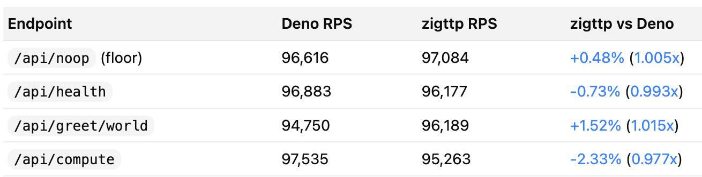

<p align="center">
  
  <p align="center"><a href="https://zigttp.timok.deno.net/">🌐 Web Site</a></p>
</p>

A JavaScript runtime built from scratch in Zig for serverless workloads. One binary, no dependencies, instant cold starts.

Where Node.js and Deno optimize for generality, zigttp optimizes for a single use case: running a request handler as fast as possible, then getting out of the way. It ships a pure-Zig JS engine (zts) with a JIT compiler, NaN-boxed values, and hidden classes - but skips everything a FaaS handler doesn't need (event loop, Promises, `require`).

[](https://github.com/GIScience/badges#experimental)
> Not Ready (yet)! Still under active development.

### What makes it different

**Opinionated language subset.** TypeScript with the footguns removed. No classes, no `this`, no `var`, no `while` loops - just functions, `let`/`const`, arrow functions, destructuring, `for...of`, and `match` expressions. Unsupported features fail at parse time with a suggested alternative, not at runtime with a cryptic stack trace.

**JSX as a first-class primitive.** The parser handles JSX directly - no Babel, no build step. Write TSX handlers that return server-rendered HTML.

**Compile-time verification.** `-Dverify` proves your handler correct at build time: every code path returns a Response, Result values are checked before access, no unreachable code. This works because zigttp's JS subset has no back-edges, no exceptions, and no non-local jumps - the IR tree IS the control flow graph. See [verification docs](docs/verification.md).

**Strict boolean sound mode.** `-Dsound` (or `--sound`) rejects truthy/falsy coercion in conditions and logical operators. The checker now performs progressive type inference for known virtual-module imports, `match` expressions, nullable returns like `env()`/`cacheGet()`, and Result-shaped values like `jwtVerify(...).ok`. See [sound mode docs](docs/sound-mode.md).

**Compile-time evaluation.** `comptime()` folds expressions at load time, modeled after Zig's comptime. Hash a version string, uppercase a constant, precompute a config value - all before the handler runs.

**Contract manifests and policy enforcement.** `-Dcontract` emits a machine-readable `contract.json` describing what your handler is allowed to do: which modules it imports, which env vars it reads, which hosts it calls, which cache namespaces it uses. `-Dpolicy=policy.json` turns that into an enforced least-privilege build for precompiled handlers by rejecting disallowed env vars, outbound hosts, and cache namespaces at build time and runtime. Non-literal arguments honestly report `"dynamic": true`.

**Native modules over JS polyfills.** Common FaaS needs (JWT auth, JSON Schema validation, caching, crypto) are implemented in Zig and exposed as `zigttp:*` virtual modules with zero interpretation overhead.

### Numbers



3ms runtime init. 1.2MB binary. 4MB memory baseline. Pre-warmed handler pool with per-request isolation. See [performance docs](docs/performance.md) for cold start breakdowns and deployment patterns.

## Quick Start

Build with Zig 0.16.0 or later:

```bash
zig build -Doptimize=ReleaseFast

# Run with inline handler
./zig-out/bin/zigttp-server -e "function handler(r) { return Response.json({hello:'world'}) }"

# Or with a handler file
./zig-out/bin/zigttp-server examples/handler.ts
```

Test it:

```bash
curl http://localhost:8080/
```

## Handler Example

```jsx
function HomePage() {
    return (
        <html>
            <head>
                <title>Hello World</title>
            </head>
            <body>
                <h1>Hello World</h1>
                <p>Welcome to zigttp-server!</p>
            </body>
        </html>
    );
}

function handler(request) {
    if (request.url === "/") {
        return Response.html(renderToString(<HomePage />));
    }

    if (request.url === "/api/echo") {
        return Response.json({
            method: request.method,
            url: request.url,
            body: request.body,
        });
    }

    return Response.text("Not Found", { status: 404 });
}
```

## HTMX Example

zigttp includes native support for HTMX attributes in JSX:

```jsx
function TodoForm() {
    return (
        <form
            hx-post="/todos"
            hx-target="#todo-list"
            hx-swap="beforeend">
            <input type="text" name="text" required />
            <button type="submit">Add Todo</button>
        </form>
    );
}

function handler(request) {
    if (request.url === "/" && request.method === "GET") {
        return Response.html(renderToString(<TodoForm />));
    }

    if (request.url === "/todos" && request.method === "POST") {
        // Parse form data, create todo item
        const todoHtml = renderToString(
            <div class="todo-item">New todo item</div>
        );
        return Response.html(todoHtml);
    }

    return Response.text("Not Found", { status: 404 });
}
```

See [examples/htmx-todo/](examples/htmx-todo/) for a complete HTMX application.

## Virtual Modules

zigttp provides native virtual modules via `import { ... } from "zigttp:*"` syntax. These run as native Zig code with zero JS interpretation overhead.

### Available Modules

| Module | Exports | Description |
|--------|---------|-------------|
| `zigttp:env` | `env` | Environment variable access |
| `zigttp:crypto` | `sha256`, `hmacSha256`, `base64Encode`, `base64Decode` | Cryptographic functions |
| `zigttp:router` | `routerMatch` | Pattern-matching HTTP router |
| `zigttp:auth` | `parseBearer`, `jwtVerify`, `jwtSign`, `verifyWebhookSignature`, `timingSafeEqual` | JWT auth and webhook verification |
| `zigttp:validate` | `schemaCompile`, `validateJson`, `validateObject`, `coerceJson`, `schemaDrop` | JSON Schema validation |
| `zigttp:cache` | `cacheGet`, `cacheSet`, `cacheDelete`, `cacheIncr`, `cacheStats` | In-memory key-value cache with TTL and LRU |

### Auth Example

```typescript
import { parseBearer, jwtVerify, jwtSign } from "zigttp:auth";

function handler(req: Request): Response {
    const token = parseBearer(req.headers["authorization"]);
    if (token === null) return Response.json({ error: "unauthorized" }, { status: 401 });

    const result = jwtVerify(token, "my-secret");
    if (!result.ok) return Response.json({ error: result.error }, { status: 401 });

    return Response.json({ user: result.value });
}
```

### Validation Example

```typescript
import { schemaCompile, validateJson } from "zigttp:validate";

schemaCompile("user", JSON.stringify({
    type: "object",
    required: ["name", "email"],
    properties: {
        name: { type: "string", minLength: 1, maxLength: 100 },
        email: { type: "string", minLength: 5 },
        age: { type: "integer", minimum: 0, maximum: 200 }
    }
}));

function handler(req: Request): Response {
    if (req.method === "POST") {
        const result = validateJson("user", req.body);
        if (!result.ok) return Response.json({ errors: result.errors }, { status: 400 });
        return Response.json({ user: result.value }, { status: 201 });
    }
    return Response.json({ ok: true });
}
```

### Cache Example

```typescript
import { cacheGet, cacheSet, cacheStats } from "zigttp:cache";

function handler(req: Request): Response {
    const cached = cacheGet("api", req.url);
    if (cached !== null) return Response.json(JSON.parse(cached));

    const data = { message: "computed", path: req.url };
    cacheSet("api", req.url, JSON.stringify(data), 60); // TTL: 60 seconds

    return Response.json(data);
}
```

See [examples/modules_all.ts](examples/modules_all.ts) for an integration example using all modules together.

## CLI Options

```bash
zigttp-server [options] <handler.js>

Options:
  -p, --port <PORT>     Port (default: 8080)
  -h, --host <HOST>     Host (default: 127.0.0.1)
  -e, --eval <CODE>     Inline JavaScript handler
  -m, --memory <SIZE>   JS runtime memory limit (default: 0 = no limit)
  -n, --pool <N>        Runtime pool size (default: auto)
  --cors                Enable CORS headers
  --static <DIR>        Serve static files
  --outbound-http       Enable native outbound bridge (fetchSync/httpRequest)
  --outbound-host <H>   Restrict outbound bridge to exact host H
  --outbound-timeout-ms Connect timeout for outbound bridge (ms)
  --outbound-max-response <SIZE>
```

## Key Features

**Performance**: NaN-boxing, index-based hidden classes with SoA layout and O(1) transition lookups, polymorphic inline cache (PIC), generational GC, hybrid arena allocation for request-scoped workloads.

**HTTP/FaaS Optimizations**: Shape preallocation for Request/Response objects, pre-interned HTTP atoms, HTTP string caching, LockFreePool handler isolation, zero-copy response mode.

**Compile-Time Analysis**: Handler verification (`-Dverify`) proves correctness at build time. Contract manifests (`-Dcontract`) enumerate capabilities. Build-time precompilation eliminates runtime parsing.

**Language Support**: ES5 + select ES6 features (for...of, typed arrays, exponentiation), native TypeScript/TSX stripping, compile-time evaluation with `comptime()`, direct JSX parsing.

**JIT Compilation**: Baseline JIT for x86-64 and ARM64, inline cache integration, object literal shapes, type feedback, adaptive compilation.

**Virtual Modules**: Native `zigttp:auth` (JWT/HS256, webhook signatures), `zigttp:validate` (JSON Schema), `zigttp:cache` (TTL/LRU key-value store), plus `zigttp:env`, `zigttp:crypto`, `zigttp:router`.

**Developer Experience**: Fetch-like HTTP surface (`Response.*`, `Response(body, init?)`, `Request(url, init?)`, `Headers(init?)`, `request.text()`, `request.json()`, `headers.get()`, `fetchSync()`), console methods (log, error, warn, info, debug), static file serving with LRU cache, CORS support, pool metrics.

## Native Outbound Bridge

When enabled with `--outbound-http`, handlers can call the higher-level `fetchSync()` helper:

```javascript
const resp = fetchSync("http://127.0.0.1:8787/v1/ops?view=state", {
  method: "GET",
  headers: { Authorization: "Bearer ..." }
});

const data = resp.json();
```

`fetchSync()` returns a response-shaped object with `status`, `ok`, `headers.get(name)`, `text()`, and `json()`.

Current helper semantics:
- `headers.get(name)` is case-insensitive and returns the last observed value for that header name, or `null`.
- `Headers(init?)`, `Request(url, init?)`, and `Response(body, init?)` are available as factory-style HTTP types. `new` is not supported by the parser, so call them as plain functions.
- `Headers` instances support `get(name)`, `set(name, value)`, `append(name, value)`, `has(name)`, and `delete(name)`.
- `text()` returns the raw body string, or `""` when no body is present.
- `json()` returns parsed JSON, or `undefined` when the body is empty or invalid JSON.
- Body readers are single-use. Once `text()` or `json()` is called on a request/response object, subsequent body reads throw. Use `request.body` if you need the raw body string without consuming it.
- Validation, allowlist, network, timeout, and size-limit failures do not throw into handler code; `fetchSync()` returns a `599` response with a JSON body containing `error` and `details`.

The lower-level `httpRequest(jsonString)` bridge remains available:

```javascript
const raw = httpRequest(JSON.stringify({
  url: "http://127.0.0.1:8787/v1/ops?view=state",
  method: "GET",
  headers: { Authorization: "Bearer ..." }
}));
```

`httpRequest` returns JSON with either `{ ok: true, status, reason, body, content_type? }` or `{ ok: false, error, details }`.
Use `--outbound-host` to restrict egress to a single host.

## Compile-Time Toolchain

zigttp's compile-time toolchain goes beyond precompilation. It can verify your handler is correct, extract a contract manifest of its capabilities, and embed optimized bytecode - all at build time.

```bash
# Development build (runtime handler loading)
zig build -Doptimize=ReleaseFast

# Production build (embedded bytecode, 16% faster cold starts)
zig build -Doptimize=ReleaseFast -Dhandler=examples/handler.ts

# Verify handler correctness at compile time
zig build -Dhandler=handler.ts -Dverify

# Emit contract manifest (what the handler is allowed to do)
zig build -Dhandler=handler.ts -Dcontract

# Enforce a capability policy for a precompiled handler
zig build -Dhandler=handler.ts -Dpolicy=policy.json

# Combine all passes
zig build -Doptimize=ReleaseFast -Dhandler=handler.ts -Dverify -Dcontract -Dpolicy=policy.json -Daot
```

### Handler Verification (`-Dverify`)

The verifier statically proves three properties of your handler at compile time:

1. **Every code path returns a Response.** Missing `else` branches, `switch` cases without `default`, and paths that fall through without returning are all caught.
2. **Result values are checked before access.** Calls like `jwtVerify` and `validateJson` return Result objects. The verifier ensures `.ok` is checked before `.value` is accessed.
3. **No unreachable code.** Statements after an unconditional return produce a warning.

This works because zigttp's JS subset eliminates all non-trivial control flow - no `while`, no `try/catch`, no `break/continue`. The IR tree is the control flow graph. Verification is a recursive tree walk, not a fixpoint dataflow analysis.

```
$ zig build -Dhandler=handler.ts -Dverify

verify error: not all code paths return a Response
  --> handler.ts:2:17
   |
  2 | function handler(req) {
   |                 ^
   = help: ensure every branch (if/else, switch/default) ends with a return statement
```

See [docs/verification.md](docs/verification.md) for the full specification.

### Contract Manifest (`-Dcontract`)

The contract describes what your handler does before it runs. It extracts:

- **Virtual modules** imported and which functions are used
- **Environment variables** accessed via `env("NAME")` - literal names are enumerated, dynamic access is flagged
- **Outbound hosts** called via `fetchSync("https://...")` - hosts are extracted from URL literals
- **Cache namespaces** used by `cacheGet`/`cacheSet`/etc.
- **Verification results** (when combined with `-Dverify`)
- **Route patterns** (when combined with `-Daot`)

```json
{
  "version": 1,
  "modules": ["zigttp:auth", "zigttp:cache"],
  "functions": {
    "zigttp:auth": ["jwtVerify", "parseBearer"],
    "zigttp:cache": ["cacheGet", "cacheSet"]
  },
  "env": { "literal": ["JWT_SECRET"], "dynamic": false },
  "egress": { "hosts": ["api.example.com"], "dynamic": false },
  "cache": { "namespaces": ["sessions"], "dynamic": false }
}
```

The `"dynamic": false` fields are the key signal. They mean "we can enumerate every value statically." When a handler uses a variable instead of a string literal (`env(someVar)` instead of `env("JWT_SECRET")`), the contract honestly reports `"dynamic": true`.

### Capability Policy (`-Dpolicy`)

Policies are opt-in and apply to precompiled handlers. They consume the same contract data at build time and fail the build if the handler exceeds the allowed env vars, outbound hosts, or cache namespaces. The validated policy is then embedded into the generated handler metadata and enforced again at runtime.

```json
{
  "env": { "allow": ["JWT_SECRET"] },
  "egress": { "allow_hosts": ["api.example.com"] },
  "cache": { "allow_namespaces": ["sessions"] }
}
```

Omit a section to leave that capability unrestricted. If a section is present, dynamic access in that category is rejected because zigttp cannot fully enumerate it.

### Precompiled Bytecode

**Cold Start Performance**:

| Platform | Cold Start | Runtime Init | Status |
|----------|------------|--------------|--------|
| **macOS** (development) | ~103ms | 3ms | ✅ Current |
| **Linux** (production) | ~18-33ms (planned) | 3ms | 🚧 Future |

**macOS Performance** (development environment):
- Total cold start: ~103ms (2-3x faster than Deno)
- Runtime initialization: 3ms (highly optimized)
- dyld overhead: 80-90ms (unavoidable on macOS, affects all binaries)
- Competitive for development, acceptable for local testing

**Linux Target** (future production optimization):
- Static linking with musl libc
- Expected cold start: 18-33ms (70-85ms faster than macOS)
- Zero dynamic dependencies
- Requires fixing JIT cross-compilation issues

**Embedded Bytecode Optimization** (recommended for all platforms):
```bash
zig build -Doptimize=ReleaseFast -Dhandler=path/to/handler.js
```

Benefits:
- Eliminates runtime parsing and compilation
- Smaller container images (single binary)
- Reduced memory footprint
- Zero trade-offs

**Platform Strategy**:
- **macOS**: Development only (~100ms is acceptable)
- **Linux**: Production target (sub-10ms goal via static linking)
- **Pre-fork/daemon**: Alternative for sub-millisecond response times

See [Performance](docs/performance.md) for detailed profiling analysis and deployment patterns.

## Documentation

- [User Guide](docs/user-guide.md) - Complete handler API reference, routing patterns, examples
- [Verification](docs/verification.md) - Compile-time handler verification: checks, diagnostics, examples
- [Architecture](docs/architecture.md) - System design, runtime model, project structure
- [JSX Guide](docs/jsx-guide.md) - JSX/TSX usage and server-side rendering
- [TypeScript](docs/typescript.md) - Type stripping, compile-time evaluation
- [Performance](docs/performance.md) - Benchmarks, cold starts, optimizations, deployment patterns
- [Feature Detection](docs/feature-detection.md) - Unsupported feature detection matrix
- [API Reference](docs/api-reference.md) - Zig embedding API, extending with native functions

## JavaScript Subset

zts implements ES5 with select ES6+ extensions:

**Supported**: Strict mode, let/const, arrow functions, template literals, destructuring, spread operator, for...of (arrays), optional chaining, nullish coalescing, typed arrays, exponentiation operator, Math extensions, modern string methods (replaceAll, trimStart/End), globalThis, `range(end)` / `range(start, end)` / `range(start, end, step)`, `match` expression (pattern matching with literal and object patterns).

**Not Supported**: Classes, async/await, Promises, `var`, `while`/`do-while` loops, `this`, `new`, `try/catch`, regular expressions. All unsupported features are detected at parse time with helpful error messages suggesting alternatives.

See [User Guide](docs/user-guide.md#javascript-subset-reference) for full details.

## License

MIT licensed.

## Credits

- **zts** - Pure Zig JavaScript engine (part of this project)
- [Zig](https://ziglang.org/) programming language
- Codex & Claude
