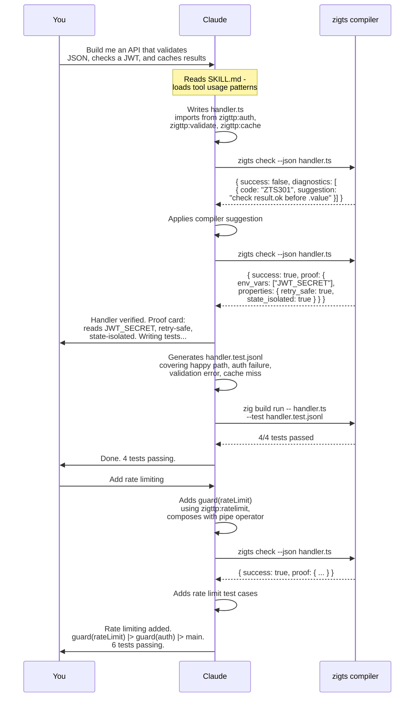
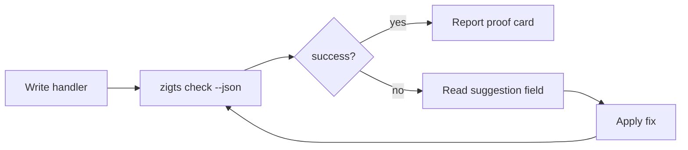

# Developing with Claude Tool Support

zigttp ships a skill file that turns Claude Code into a compiler-aware coding partner. Instead of guessing at language rules or hallucinating APIs, Claude runs the zigts compiler, reads its structured output, and follows its suggestions. This document starts with what that looks like in practice, then explains how to set it up yourself.

---

## What a Session Looks Like

Here is a real development flow. You type natural language. Claude writes code, runs the compiler, fixes what the compiler rejects, and proves the result correct - all without you touching a terminal.



The key thing to notice: Claude never guesses whether the code is correct. It runs `zigts check --json`, reads the structured diagnostics, and follows the compiler's `suggestion` field when something is wrong. The compiler is the authority. The skill file just teaches Claude how to use it.

### What You See in the Chat

In practice the exchange above looks like this in your terminal or IDE:

> **You:** Build me an API handler that validates incoming JSON against a schema, checks a JWT, caches the result, and returns the processed data.
>
> **Claude:** *writes handler.ts, runs `zigts check --json handler.ts`*
>
> The compiler flagged an unchecked Result on line 18. Fixing - need to check `result.ok` before accessing `.value`.
>
> *edits handler.ts, reruns `zigts check --json handler.ts`*
>
> Handler verified. Proof card:
> - **Env vars:** `JWT_SECRET`
> - **Modules:** `zigttp:auth`, `zigttp:validate`, `zigttp:cache`
> - **Properties:** retry-safe, injection-safe, state-isolated
>
> Writing tests for the four code paths: happy path, auth failure, validation error, cache miss.
>
> *writes handler.test.jsonl, runs tests*
>
> 4/4 passing.

> **You:** Add rate limiting.
>
> **Claude:** *adds `import { rateCheck } from "zigttp:ratelimit"`, composes as `guard(rateLimit) |> guard(requireAuth) |> mainHandler`, runs `zigts check --json handler.ts`*
>
> Verified. Added two test cases for rate limit exceeded and rate limit passed. 6/6 passing.

The compiler stays in the loop at every step. Claude does not ship code that the compiler has not verified.

---

## How It Works

The integration has two parts:

1. A **skill file** (`SKILL.md`) that teaches Claude how to use the zigts compiler as a tool: how to invoke it, how to read its structured JSON output, and how to apply its suggestions. It includes enough language reference for Claude to write reasonable first drafts, but the compiler is the authority on what is correct.

2. A **compiler-in-the-loop** workflow where Claude runs `zigts check --json` after every edit, reads the structured diagnostics, and applies the compiler's suggestions until the handler passes verification. The compiler knows the restricted grammar better than any language model - the skill just teaches Claude to defer to it.

No MCP server. No protocol adapter. No configuration wiring. The skill is a markdown file. The compiler is a binary that emits JSON. Claude reads both.

---

## Setup

### New Project

```bash
zigttp init my-app
cd my-app
```

`zigttp init` scaffolds the project structure: handler, tests, manifest. Agent tooling is installed separately.

### Installing the Skill

The skill files need to live in the project's local `.claude/skills/` directory (not the global `~/.claude/skills/`). This keeps the skill scoped to the project and discoverable by Claude Code when working in that repo.

```bash
# From your project root
zigttp agent init
```

This writes skill files, hook scripts, and `.claude/settings.json` into the current directory:

```
my-app/
  src/handler.ts
  tests/handler.test.jsonl
  zigttp.json
  .claude/
    skills/zigts-expert/
      SKILL.md              # Compiler tool usage, language reference
      references/
        virtual-modules.md  # Full API docs for zigttp:* imports
        testing-replay.md   # JSONL test format and replay workflow
        jsx-patterns.md     # JSX/TSX component patterns
    skills/zigttp-virtual-module-author/
      SKILL.md              # Built-in virtual module authoring workflow
      references/
        capability-discipline.md
        module-specs.md
        law-review.md
    hooks/
      pre-edit-zts.sh       # PreToolUse: check before edits
      post-edit-zts.sh      # PostToolUse: analyze after edits
      pre-edit-zig-module.sh
      post-edit-zig-module.sh
      session-start.sh      # SessionStart: export policy env vars
    settings.json           # Hook wiring and deny rules
```

Add `.claude/skills/` and `.claude/hooks/` to `.gitignore`. These are local tool configuration, not project source.

### Existing Project

Same process. Run `zigttp agent init` from the project root. It writes the local agent tooling without touching your handler code.

`zigts init` still exists for the older handler-only setup, but `zigttp agent init` is the canonical path now.

### Manual Setup

If you prefer not to run `zigttp agent init`, copy the skill files from any project that has them, or point Claude Code at them via your global `~/.claude/CLAUDE.md`:

```markdown
<skills>
  zigts handler code -> /path/to/zigts-expert/SKILL.md
</skills>
```

The global approach works but means the skill is active in every project, not just zigttp ones. The local `.claude/skills/` approach is preferred.

---

## The Compiler-in-the-Loop

This is the core workflow. It replaces the usual "write code, hope it works, debug at runtime" cycle with a tight feedback loop where the compiler tells Claude exactly what to fix.

### The Loop



### What the Compiler Returns

On success, the compiler produces a **proof card** - a summary of what the handler does, derived from static analysis:

```json
{
  "success": true,
  "proof": {
    "env_vars": ["JWT_SECRET"],
    "outbound_hosts": ["api.stripe.com"],
    "virtual_modules": ["zigttp:auth", "zigttp:cache"],
    "properties": {
      "retry_safe": true,
      "idempotent": false,
      "injection_safe": true,
      "deterministic": false,
      "read_only": false,
      "state_isolated": true,
      "fault_covered": true
    }
  },
  "diagnostics": []
}
```

On error, each diagnostic includes a `suggestion` field that Claude follows directly:

```json
{
  "success": false,
  "diagnostics": [
    {
      "code": "ZTS301",
      "severity": "error",
      "message": "result.value accessed without checking result.ok first",
      "file": "handler.ts",
      "line": 18,
      "column": 28,
      "suggestion": "check result.ok before accessing result.value"
    }
  ]
}
```

The `suggestion` field is authoritative. Claude follows it rather than inventing alternatives.

### Diagnostic Code Ranges

| Range | Category | Examples |
|-------|----------|---------|
| ZTS0xx | Parser | Unsupported syntax (`try/catch`, `class`, `while`, `async`) |
| ZTS1xx | Sound mode | Type safety violations (mixed-type addition, non-boolean conditions) |
| ZTS2xx | Type checker | Type mismatches, wrong argument counts, unknown properties |
| ZTS3xx | Handler verifier | Missing Response returns, unchecked Result values, state isolation |

---

## What Claude Knows from the Skill

The skill file gives Claude enough context to write reasonable first drafts. The compiler corrects the rest.

### Language Subset

zigts is not TypeScript. It is a restricted subset compiled by a Zig-based compiler. Claude knows the full allowed/blocked feature matrix:

**Allowed:** `let`, `const`, `function`, arrow functions, destructuring, `if/else`, `for...of`, template literals, optional chaining (`?.`), nullish coalescing (`??`), `match` expressions, pipe operator (`|>`), `assert` statements, `distinct type` declarations, type annotations, interfaces, `readonly` fields, type guards (`x is T`), template literal types.

**Blocked:** `class`, `while`, `do...while`, `switch`/`case`, C-style `for`, `for...in`, `try/catch`, `throw`, `var`, `null`, `==`/`!=`, `++`/`--`, regex, `new`, `this`, `async/await`, `Promise`, `delete`.

Claude will not write blocked features. If you ask for a retry loop, it uses `for (const _ of range(n))`. If you ask for error handling, it uses Result types. If you ask for async operations, it uses `fetchSync()` with `parallel()` or `race()`.

### Virtual Modules

Claude knows every `zigttp:*` module and its exports. When you describe what your handler needs ("add JWT auth", "cache user profiles", "validate the request body"), Claude imports the right bindings:

```typescript
import { parseBearer, jwtVerify } from "zigttp:auth";
import { cacheGet, cacheSet } from "zigttp:cache";
import { schemaCompile, validateJson } from "zigttp:validate";
```

Every import is a provable contract. The compiler records exactly which modules and bindings a handler uses, so Claude keeps imports minimal.

### Error Handling

Claude uses two patterns for fallible operations:

**Result types** for functions like `jwtVerify`, `validateJson`, `coerceJson`:

```typescript
const result = jwtVerify(token, secret);
if (!result.ok) return Response.json({ error: result.error }, { status: 403 });
const claims = result.value;
```

**Optional narrowing** for functions like `env()`, `cacheGet()`, `parseBearer()`:

```typescript
const token = parseBearer(req.headers["authorization"]);
if (!token) return Response.json({ error: "unauthorized" }, { status: 401 });
// token is narrowed to string here
```

The verifier (`-Dverify`) enforces that `.ok` is checked before `.value` and that optionals are narrowed before use. Claude writes code that passes verification on the first try because the skill teaches these patterns explicitly.

### Routing and Composition

Claude uses `match` expressions for routing and `guard()` with the pipe operator for middleware composition:

```typescript
// Pattern matching
return match (req) {
    when { method: "GET", path: "/health" }:
        Response.json({ ok: true })
    when { method: "POST", path: "/echo" }:
        Response.json({ echo: req.body })
    default:
        Response.text("Not Found", { status: 404 })
};

// Guard composition
const handler = guard(rateLimit) |> guard(requireAuth) |> mainHandler;
```

---

## Writing Tests with Claude

Claude knows the JSONL test format and can generate test cases for your handlers.

### The Format

Each test is a sequence of JSON lines: a test name, an HTTP request, optional I/O stubs for virtual module calls, and response assertions.

```jsonl
{"type":"test","name":"health check returns 200"}
{"type":"request","method":"GET","url":"/health","headers":{},"body":null}
{"type":"expect","status":200,"bodyContains":"ok"}

{"type":"test","name":"auth failure returns 401"}
{"type":"request","method":"GET","url":"/api/data","headers":{"authorization":"Bearer bad"},"body":null}
{"type":"io","seq":0,"module":"auth","fn":"parseBearer","args":["Bearer bad"],"result":"bad"}
{"type":"io","seq":1,"module":"auth","fn":"jwtVerify","args":["bad","secret"],"result":{"ok":false,"error":"invalid signature"}}
{"type":"expect","status":403,"bodyContains":"invalid signature"}
```

The `io` entries stub virtual module calls in execution order. The `seq` field (0-indexed) controls ordering. `result` is the return value the stub provides. Use `null` for `undefined` returns.

### Running Tests

```bash
# During development
zig build run -- handler.ts --test tests/handler.test.jsonl

# At build time (fails the build on test failure)
zig build -Dhandler=handler.ts -Dtest-file=tests/handler.test.jsonl
```

### What Claude Does

When you ask Claude to write tests, it reads the handler to identify every code path, determines which virtual module calls each path makes, and generates a test case per path with the correct I/O stubs and expected status codes.

---

## Verification and Contracts

These are compile-time features that Claude invokes when building for production or when you want proof that your handler is correct.

### Verification (`-Dverify`)

Proves four things about your handler at compile time:

1. **Exhaustive Response returns** - every code path returns a Response
2. **Result checking** - `.ok` is checked before `.value` on every Result
3. **Unreachable code** - no dead code after unconditional returns
4. **State isolation** - no mutable state leaks between requests

```bash
zig build -Dhandler=handler.ts -Dverify
```

### Contracts (`-Dcontract`)

Extracts a machine-readable summary of what your handler does:

```bash
zig build -Dhandler=handler.ts -Dcontract
```

The contract includes: routes served, environment variables read, external hosts contacted, cache namespaces used, SQL queries registered, handler properties (retry-safe, idempotent, deterministic, etc.), and exhaustive execution paths with their I/O sequences.

### Contract Comparison

When upgrading a handler, compare the old and new contracts to detect breaking changes:

```bash
zigts prove old-contract.json new-contract.json
# Exit 0: safe upgrade
# Exit 1: breaking change detected
# Exit 2: needs manual review
```

---

## Deterministic Replay

Record all virtual module calls during development, then replay them against new code to catch regressions.

```bash
# Record traces while running
zig build run -- handler.ts --trace traces.jsonl -p 3000
# (send requests, then stop)

# Replay against modified code
zig build run -- handler.ts --replay traces.jsonl

# Build-time replay (fails on regression)
zig build -Dhandler=handler.ts -Dreplay=traces.jsonl
```

This works because virtual modules are the only I/O boundary. Handlers are deterministic functions of (Request, VirtualModuleResponses). A trace captures every call and result. Replay feeds the same results back and asserts the handler produces the same Response.

---

## Tips

**Let the compiler lead.** If Claude writes code and `zigts check` reports an error, the suggestion field has the fix. Claude follows it. You do not need to debug zigts compiler errors yourself.

**Ask for the proof card.** After Claude finishes writing a handler, ask it to run `zigts check --json --contract handler.ts`. The proof card tells you exactly what the handler does: which secrets it reads, which hosts it calls, whether it is retry-safe. This is documentation generated from static analysis, not comments that can drift.

**Write tests early.** The JSONL format is simple enough that Claude can generate comprehensive test suites from a handler's code paths. Tests run in milliseconds because they replay stubbed I/O with no network calls.

**Use verification in CI.** Add `-Dverify` and `-Dtest-file=` to your build step. If the handler cannot be proven correct, the build fails. This catches regressions that unit tests might miss: unchecked Results, missing Response returns, state leaks.

**Keep handlers small.** One handler per file. The compiler's proof unit is a single file. Smaller handlers produce tighter contracts and faster verification. Use `system.json` with stable handler `name` fields, `serviceCall()` for internal edges, and `zigts link` for multi-handler architectures.

---

## Hooks

`zigttp agent init` installs the handler hooks and the virtual-module hooks into `.claude/hooks/` alongside the skill files. Each script calls `zigts`, parses the output, and returns structured JSON to Claude Code.

### Pre-Edit Hook (PreToolUse)

`.claude/hooks/pre-edit-zts.sh` runs before Edit/Write/MultiEdit on `.ts`, `.tsx`, `.js`, or `.jsx` files. It calls `zigts check --json` on the current file and surfaces existing violations as warnings. The hook does not block edits - it gives Claude context about pre-existing problems.

Timeout: 12 seconds (script), 15 seconds (harness). On timeout or missing binary, the hook exits silently and the edit proceeds.

### Post-Edit Hook (PostToolUse)

`.claude/hooks/post-edit-zts.sh` runs after Edit/Write/MultiEdit on handler files. It calls `zigts edit-simulate` on the edited file and reports violations, distinguishing new ones from pre-existing. Advisory only; the edit is already on disk.

Timeout: 30 seconds. On timeout or missing binary, the hook exits silently.

### Session Start Hook

`.claude/hooks/session-start.sh` runs at session start when `CLAUDE_ENV_FILE` is set. It calls `zigts expert meta --json` and writes `ZIGTS_POLICY_VERSION` and `ZIGTS_POLICY_HASH` into the session environment.

### Hook Sources

The canonical hook scripts live in `packages/tools/src/hooks/` and are embedded into the `zigts` binary via `@embedFile`. Running `zigttp agent init` copies them to `.claude/hooks/` with executable permissions and writes `.claude/settings.json`. To update them after a zigttp or zigts upgrade, run `zigttp agent init --force`.

### Configuration

Hooks are configured in `.claude/settings.json` under `hooks.PreToolUse` and `hooks.PostToolUse`. The `permissions.deny` list prevents Claude from editing hook scripts or the rule registry directly. To disable hooks, remove the `hooks` section from settings.json.

---

## The `zigts expert` CLI

`zigts expert` is a stable, versioned interface for hooks and CI. It groups analysis commands under a single namespace with consistent JSON output.

```bash
zigts expert meta [--json]                    # Policy metadata (version, hash, rule count)
zigts expert verify-paths <file>... [--json]  # Full analysis on files, exit 1 on errors
zigts expert review-patch ...                 # Delegates to zigts review-patch
zigts expert edit-simulate ...                # Delegates to zigts edit-simulate
zigts expert describe-rule ...                # Delegates to zigts describe-rule
zigts expert search ...                       # Delegates to zigts search
```

`expert meta --json` output:

```json
{
  "compiler_version": "0.14.0",
  "policy_version": "2026.04.1",
  "policy_hash": "9ede01bd...",
  "rule_count": 25,
  "categories": {"verifier": 11, "policy": 8, "property": 6},
  "mode": "embedded"
}
```

`expert verify-paths --json` output:

```json
{
  "ok": true,
  "policy_version": "2026.04.1",
  "policy_hash": "9ede01bd...",
  "checked_files": ["handler.ts"],
  "violations": []
}
```

The remaining subcommands take the same arguments as their top-level equivalents. The `expert` prefix gives hooks and CI a stable interface independent of the top-level command layout.
