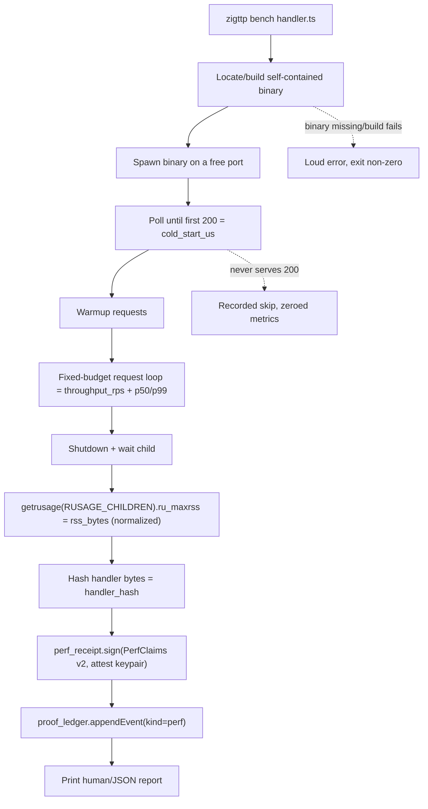

# feat: zigttp bench - signed cold-start/RSS/throughput perf receipts

**Product Contract preservation:** No upstream brainstorm; this plan was bootstrapped from the deferred "performance as proof" backlog item (see Sources). No product-scope decisions were inherited or changed.

---

## Summary

Performance is the only zigttp claim that ships as unverified markdown. Correctness, security, and behavior are all proven and attested; cold-start, RSS, and throughput are hardcoded prose (`docs/performance.md`, and the help strings in `dev_cli.zig`: "cold-start floor 3.5 ms, RSS 13 MB, throughput 112k req/s"). This plan adds a user-facing `zigttp bench` command that measures cold-start latency, peak RSS, and request throughput against the real self-contained binary on the user's own hardware, then signs the numbers into a third-party-verifiable `kind=perf` receipt.

The receipt signing and ledger plumbing already landed (Slice H): `zigts.perf_receipt.sign/verify`, the `kind=perf` ledger row, and `PerfPayload`. Today that machinery only fires inside the pi/expert apply loop, measures latency only, and is API-key-gated. This plan reuses that signing path, extends the receipt schema with the three missing metrics, and exposes a standalone keyless command that turns the unverified perf claims into attested facts.

---

## Problem Frame

**What is broken.** A reader of zigttp's marketing cannot verify the performance numbers the way they can verify a correctness or security claim. The cold-start/RSS figures are round numbers in prose that a fresh-eyes review already flagged as the weak spot in the "every claim is proven" story.

**Why now.** The expensive half is already built. `perf_receipt.zig` defines an EdDSA JWS receipt with `sign`/`verify`, a stable `typ` discriminator (`zigttp-perf+jws`), tamper detection, and a schema that explicitly documents reserved future fields ("older verifiers ignore unknown fields; newer verifiers light up extra checks only when the fields are present"). `proof_ledger.zig` already serializes a `kind=perf` row with an additive optional `perf` payload. The remaining work is measurement plus a CLI seam, not new crypto.

**What exists today vs. what is missing.**
- Landed: `perf_receipt.sign/verify`, `proof_ledger.PerfPayload`, the apply-time probe `perf_probe_lib.recordPerfReceipt` (latency p50/p99 + alloc bytes, injected into pi via `setProbeFn` in `dev_cli.zig`), the in-process latency harness `benchmark.runHandlerCorpusFromSource`.
- Missing: any cold-start or RSS measurement anywhere in the tree (no `getrusage`/`ru_maxrss` usage exists); throughput measurement; a standalone keyless `zigttp bench` command; perf-receipt validation in the `verify`/`proofs` surface (`zigttp verify <url>` validates attestation envelopes only; `proofs verify` does bundle integrity, neither validates a perf JWS).

---

## Requirements

- **R1.** `zigttp bench [handler]` measures cold-start latency, peak RSS, and request throughput of the real self-contained binary on the invoking machine, plus per-request p50/p99 latency from the same run.
- **R2.** The command emits a signed `kind=perf` receipt to `.zigttp/proofs.jsonl` whose JWS commits to the handler hash and all measured metrics, reusing the persistent Ed25519 attest identity (`~/.zigttp/attest/keypair.bin`).
- **R3.** A third party can validate a perf receipt's signature without trusting the machine that produced it (parity with the existing receipt-verification story).
- **R4.** The receipt schema extension is additive: a pre-extension (v1) receipt still verifies, and a pre-extension reader still parses a new receipt's shared fields.
- **R5.** The command is keyless: it runs the in-process analyzer and local binary, with no provider API key and no network, so it works for the 100% of users the expert key-gate excludes.
- **R6.** Measurement is honest and loud: a handler that cannot be measured (fault on first call, missing binary) produces a recorded skip with zeroed metrics or a loud error, never a silent success with fabricated numbers.
- **R7.** The unverified performance numbers in `docs/performance.md` and the `dev_cli.zig` help strings are replaced with a pointer to the measured, signed receipt.

---

## Key Technical Decisions

**KTD1 - Measure the real spawned binary, not an in-process proxy.** Cold-start, RSS, and throughput are all measured by spawning the actual self-contained binary (the artifact `deploy --local` / `compile` produces), polling to its first successful response, driving a fixed-budget request loop, then reaping it. This is the number a user cares about; an in-process runtime-init proxy understates true cold-start and cannot capture process RSS. The existing in-process `benchmark` harness stays untouched and continues to serve the apply-time latency probe; the standalone command is a separate, coherent end-to-end measurement where every metric comes from one real process. (Confirmed with the user during scoping.)

**KTD2 - Extend `PerfClaims`/`PerfPayload` in place; bump `version_tag` to v2; new fields optional-on-read.** Add `cold_start_us`, `rss_bytes`, and `throughput_rps` to `PerfClaims`, the wire JSON (`buildPayloadJson`/`parseClaims`), and `proof_ledger.PerfPayload`. The signer always writes them; the parser defaults missing fields to 0 so a v1 receipt still verifies (R4). Bump `version_tag` from `zigttp-perf-v1` to `zigttp-perf-v2` to signal the richer shape, keeping `jws_typ` (`zigttp-perf+jws`) unchanged so the existing subtype guard still rejects build receipts. A separate receipt type was rejected as redundant given the schema already documents additive extension. (Confirmed with the user during scoping.)

**KTD3 - Home the command in the `zigttp` dev binary.** The Ed25519 signing keypair is runtime-only; keyless `zigts` tools receive it via `setProbeFn` injection. `zigttp bench` needs to sign directly, so it lives in `dev_cli.zig` alongside `compile`/`build`/`deploy`, loads the identity via `attest/identity.loadOrCreate`, and is listed in `help --all`'s machine/advanced surface. It is not added to `zigts`.

**KTD4 - Peak RSS via `getrusage(RUSAGE_CHILDREN)` after reap, with OS unit normalization.** No RSS primitive exists in the tree. Reading the reaped child's `ru_maxrss` is the most portable cross-process option. Normalize units: macOS reports `ru_maxrss` in bytes, Linux in kilobytes. This is a measurement detail to verify on both targets (see Open Questions) but `RUSAGE_CHILDREN` after `wait` is the chosen approach over reading `/proc/<pid>/status` (Linux-only) or `proc_pid_rusage` (macOS-only).

**KTD5 - Emit and verify only this round; defer baseline/CI gating.** The plan ships measurement plus a signed receipt plus a verification path. It does not add baseline-ratchet or CI-blocking regression gating (the `regressionBudgetUs`/`baselineRef` slots the schema reserves stay unpopulated, and the existing `ratchet`/`bench-check` infra is the future home). (Confirmed with the user during scoping.)

---

## High-Level Technical Design

`zigttp bench` is a single end-to-end measurement pipeline over one real process, feeding the existing signer and ledger.

This is directional guidance for review, not implementation specification. The faulted/skip edges (X, Y) enforce R6: failure is recorded or loud, never silently successful.

**Receipt schema delta (v1 to v2), directional:**

| Field | v1 | v2 | Notes |
|-------|----|----|-------|
| `handlerHash` | yes | yes | unchanged, 64-hex |
| `p50Us` / `p99Us` | yes | yes | now sourced from the spawned run |
| `allocBytes` | yes | yes | unchanged |
| `sampleCount` | yes | yes | unchanged |
| `coldStartUs` | - | new | optional-on-read, default 0 |
| `rssBytes` | - | new | optional-on-read, default 0 |
| `throughputRps` | - | new | optional-on-read, default 0 |
| `signedAt` | yes | yes | unchanged |

---

## Scope Boundaries

**In scope:** the `zigttp bench` command; cold-start/RSS/throughput/latency measurement of the real binary; the v2 receipt schema extension; perf-receipt signature validation in the verification surface; replacing the hardcoded perf numbers in docs and help text with a pointer to measured receipts.

**Out of scope (non-goals):**
- Changing the apply-time pi/expert perf probe (`perf_probe_lib.recordPerfReceipt`); it stays latency-only and untouched.
- Hosted telemetry or any network upload of measurements.

### Deferred to Follow-Up Work
- Baseline-ratchet and CI-blocking perf regression gating (populating the reserved `baselineRef`/`regressionBudgetUs` slots; integrating with `ratchet`/`bench-check`).
- A binary-size metric/gate (called out in the deferred VM-loop measurement-gate notes as a separate missing gate).
- Backfilling cold-start/RSS into the apply-time probe so expert-loop receipts carry the richer shape.

---

## Implementation Units

### U1. Extend the perf-receipt schema with cold-start, RSS, and throughput

**Goal:** Carry the three new metrics through the signed receipt and the ledger payload, additively (R4), so the signer commits to them and verifiers can read them.

**Requirements:** R2, R4.

**Dependencies:** none.

**Files:**
- `packages/zigts/src/perf_receipt.zig` (modify: `PerfClaims`, `wire_key`, `buildPayloadJson`, `parseClaims`, `version_tag` to `zigttp-perf-v2`; inline tests)
- `packages/runtime/src/proof_ledger.zig` (modify: `PerfPayload` struct, the `perf` object serializer, the ledger reader; inline tests)

**Approach:** Add `cold_start_us`, `rss_bytes`, `throughput_rps` to `PerfClaims` and `PerfPayload`. Add wire keys (`coldStartUs`, `rssBytes`, `throughputRps`) to `buildPayloadJson`. In `parseClaims` and the ledger reader, read the new keys as optional with default 0 (use a "get-or-default" read distinct from the existing strict `readU64` so v1 payloads without the keys still parse). Bump `version_tag`; leave `jws_typ` unchanged so the existing subtype guard is preserved.

**Patterns to follow:** the existing `wire_key` block and `buildPayloadJson`/`parseClaims` pair in `perf_receipt.zig`; the additive-optional-field convention already used for `Event.perf`/`Event.equivalence` in `proof_ledger.zig`.

**Test scenarios:**
- Happy path: `sign` then `verify` round-trips all three new fields with non-zero values.
- Edge (R4 back-compat): a v1-shaped payload (new keys absent) still verifies, with the new fields defaulting to 0.
- Error: flipping a byte in a new field invalidates the signature (extend the existing tamper test).
- Happy path: `version_tag` equals `zigttp-perf-v2` and `jws_typ` is unchanged.
- Integration: a `PerfPayload` with the new fields serializes to a ledger line and reads back equal (round-trip through `appendEvent`/`readEvents`).

### U2. Platform measurement primitives: peak RSS and monotonic timing

**Goal:** A small, reusable probe for peak child RSS (normalized to bytes) and monotonic wall-clock helpers used by the bench harness.

**Requirements:** R1.

**Dependencies:** none.

**Files:**
- `packages/runtime/src/perf_measure.zig` (new: `childPeakRssBytes()` over `getrusage(RUSAGE_CHILDREN)`, OS unit normalization, monotonic timer helper; inline tests)

**Approach:** Wrap `getrusage` (via `std.posix`/`std.c` per what 0.16.0 exposes; this repo already prefers `std.c`/`std.posix` over `std.fs` for syscalls). Normalize `ru_maxrss`: bytes on macOS (`builtin.os.tag == .macos`), kilobytes on Linux. Keep the surface tiny; the harness owns orchestration.

**Execution note:** verify the `ru_maxrss` unit on both macOS and Linux against a known allocation before trusting it (see Open Questions).

**Patterns to follow:** the syscall style noted in repo memory (`std.posix`/`std.c` direct calls, not `std.fs`).

**Test scenarios:**
- Happy path: after a child that allocates a known amount exits, `childPeakRssBytes()` returns a positive byte count.
- Edge: Linux kilobyte values are multiplied to bytes; macOS byte values pass through (compile-time `builtin.os.tag` branch covered by a unit assertion on the normalization function with a synthetic input).
- Edge: monotonic timer is non-decreasing across two reads.

### U3. Spawn-and-measure harness: cold-start, throughput, latency, RSS

**Goal:** Drive one real spawned binary through cold-start, warmup, a fixed-budget request loop, and reap, producing all five metrics.

**Requirements:** R1, R6.

**Dependencies:** U2.

**Files:**
- `packages/runtime/src/bench_command.zig` (new: locate/spawn binary, poll-to-first-200, request loop, shutdown+reap, assemble metrics; inline tests)

**Approach:** Spawn the self-contained binary (`std.process.Child`) bound to a free port. Time spawn-to-first-200 as `cold_start_us`. Run warmup requests, then a fixed wall-clock budget of requests, recording per-request latencies (p50/p99) and completion count (`throughput_rps`). Shut the child down, `wait` it, then call `perf_measure.childPeakRssBytes()` for `rss_bytes`. Return a metrics struct mirroring `PerfClaims` minus the signature fields. A handler that never serves 200 within a timeout yields a recorded skip (zeroed metrics, non-fatal); a missing/unbuildable binary is a loud error.

**Execution note:** Start with a failing integration test that asserts non-zero cold-start and throughput against the benign example handler, then implement to green.

**Patterns to follow:** the budget-loop shape and zeroed-skip semantics in `benchmark.runHandlerCorpusFromSource` / `perf_probe_lib`; the example fixtures under `examples/handler/`.

**Test scenarios:**
- Happy path: against a benign handler, `cold_start_us > 0`, `throughput_rps > 0`, `p99_us >= p50_us`, sample count matches loop completions.
- Error/failure (R6): a handler that faults on first call records a skip with zeroed metrics, harness returns without crashing.
- Error/failure (R6): a missing binary path produces a loud error and non-zero result, not a zeroed success.
- Edge: free-port selection does not collide on a re-run.
- Integration: the running spawned server actually answers the probe requests (proves the spawn path, not a mock).

### U4. Wire `zigttp bench` into the dev CLI; sign and append the receipt

**Goal:** A keyless `zigttp bench [handler]` that runs the harness, signs the metrics with the attest identity, and appends a `kind=perf` row (R2, R3, R5).

**Requirements:** R2, R5, R6.

**Dependencies:** U1, U3.

**Files:**
- `packages/runtime/src/dev_cli.zig` (modify: new `bench` command block mirroring `compile`/`build`; load `attest/identity.loadOrCreate`; call `bench_command`; build `PerfClaims` v2; `perf_receipt.sign`; `proof_ledger.appendEvent`; register in `help --all`)
- `packages/runtime/src/cli_shared.zig` (modify if needed: arg parsing for `bench` flags)
- `packages/runtime/src/bench_command.zig` (modify: accept flags, expose a `runWithArgs`-style entry)

**Approach:** Mirror the dispatch and identity-loading already present for the apply-time probe wiring (`dev_cli.zig:117` `setProbeFn(perf_probe_lib.recordPerfReceipt)`). Auto-detect the handler in cwd like `deploy`. Flags: `--json`, `--no-attest` (measure and print but do not sign/append, parity with build's `--no-attest`), and a sample/budget flag. Hash the handler bytes, sign, append. Keyless throughout (no provider key path).

**Patterns to follow:** the `compile`/`build`/`deploy` command blocks in `dev_cli.zig`; `perf_probe_lib.recordPerfReceiptWithKey` for the hash -> sign -> `appendEvent` sequence; `identity.loadOrCreate` usage there.

**Test scenarios:**
- Happy path: `bench` on the example handler writes exactly one `kind=perf` row whose embedded JWS verifies and whose claims equal the printed metrics.
- Happy path: `--json` emits all five metrics with units in a stable shape.
- Edge: `--no-attest` prints measurements but writes no ledger row and signs nothing.
- Error: no handler found and none auto-detectable yields an arg error and non-zero exit, not an empty receipt.
- Edge (R5): the command path loads no provider key and makes no network call (assert the keyless path is taken).

### U5. Output formatting and retire the unverified performance numbers

**Goal:** A readable report and the removal of hardcoded perf prose in favor of a pointer to the measured, signed receipt (R7).

**Requirements:** R1, R7.

**Dependencies:** U4.

**Files:**
- `packages/runtime/src/bench_command.zig` (modify: human-readable formatter for the five metrics with units)
- `docs/performance.md` (modify: replace fixed cold-start/RSS/throughput figures with "measure on your hardware via `zigttp bench`; the numbers are signed and verifiable")
- `packages/runtime/src/dev_cli.zig` (modify: the help/blurb strings at ~832 and ~836 that hardcode "3.5 ms ... 13 MB RSS ... 112k req/s")

**Approach:** Format cold-start (ms), RSS (MB), throughput (req/s), p50/p99 (us) with explicit units. In docs and help text, state that performance is now a measured, attested fact rather than a claim, and show the `zigttp bench` invocation and where the receipt lands.

**Test scenarios:**
- Happy path: the formatter renders all five metrics with correct units from a known metrics struct.
- `Test expectation: none -- documentation and help-string edits, covered by the formatter test and U4's receipt test.`

### U6. Verification path for perf receipts

**Goal:** A third party (and the user) can validate a perf receipt's signature, closing R3 (today neither `verify` nor `proofs verify` validates a perf JWS).

**Requirements:** R3.

**Dependencies:** U1.

**Files:**
- `packages/runtime/src/bench_command.zig` (modify: a `--verify` self-check that re-reads the just-written row and validates its JWS)
- `packages/tools/src/` or `packages/runtime/src/` proofs/verify path (modify: validate `kind=perf` rows' signatures where proof rows are checked; exact file confirmed at implementation - see Open Questions)

**Approach:** Reuse `perf_receipt.verify` (signature + typ guard + claims parse). For the self-check, after `appendEvent`, read the row back and verify. For the broader surface, validate perf-row signatures wherever ledger rows are verified, surfacing the signer fingerprint. Reuse the existing build-receipt-typ rejection already proven in `perf_receipt.zig` tests.

**Patterns to follow:** `perf_receipt.verify` and the `recordPerfReceiptWithKey` test in `perf_probe_lib.zig` that already round-trips read-then-verify.

**Test scenarios:**
- Happy path: a freshly signed receipt round-trips read-then-verify and reports the signer fingerprint.
- Error: a tampered perf row fails verification loudly.
- Error: a build receipt (`zigttp-attest+jws` typ) presented as a perf receipt is rejected as the wrong subtype.
- Edge: a v1 receipt (no new fields) still verifies through the same path.

---

## Risks & Dependencies

- **Cross-process RSS portability (KTD4).** `ru_maxrss` units differ by OS and the value is process-peak, not steady-state. Mitigation: normalize per `builtin.os.tag`, verify against a known allocation on both targets (Open Questions), and label the metric "peak RSS" honestly.
- **Cold-start measurement variance.** Spawn timing is sensitive to disk cache and machine load. Mitigation: the receipt records a single observed run on the user's hardware (that is the honest, reproducible-by-them artifact); it does not claim a population statistic. Warmup is excluded from cold-start by construction.
- **CI without a built binary.** The harness needs a self-contained binary to spawn. Mitigation: U3/U4 tests build or locate the artifact the same way `deploy --local`/`compile` does; if a target cannot build one, the test skips loudly rather than fabricating numbers (R6).
- **Dependency on landed Slice H infra.** The plan assumes `perf_receipt.sign/verify`, `PerfPayload`, and `identity.loadOrCreate` are stable; all three were verified present in the current tree during planning.

---

## Open Questions

Resolve at implementation time (do not block planning):
- **`ru_maxrss` units and reliability on the CI Linux target.** Confirm kilobytes-on-Linux / bytes-on-macOS empirically before trusting the normalized number (U2 execution note).
- **Exact file for broader perf-row verification (U6).** `zigttp verify <url>` is URL-attestation only and `proofs verify` does bundle integrity; confirm whether perf-row signature validation belongs in the `proofs` subcommand path or a small extension to `verify_cli.zig`. The `--verify` self-check in `bench_command` is unaffected by this choice.
- **Which binary to spawn (U3).** Prefer the `compile`/`deploy --local` artifact; confirm whether `zigttp bench` should build one on demand when absent or require the user to build first.

---

## Sources & Research

- Deferred backlog item: memory `deferred-performance-as-proof` ("performance as a fourth proof class"; user: "valuable, we will get back to it in following release").
- Related deferred context: memory `beta-surface-tightening`; memory `deferred-vm-loop-dedupe-refresh` (notes the measurement gates are latency-only, no cold-start/RSS, no binary-size gate).
- Verified-present infra (current tree, 2026-06-28): `packages/zigts/src/perf_receipt.zig` (sign/verify, v1 schema with documented additive extension), `packages/runtime/src/proof_ledger.zig` (`PerfPayload`, `kind=perf` row), `packages/runtime/src/perf_probe_lib.zig` (apply-time latency probe, hash->sign->append pattern), `packages/runtime/src/benchmark.zig` (in-process latency harness), `packages/runtime/src/dev_cli.zig` (command dispatch, `setProbeFn` wiring at :117, hardcoded perf strings at ~832/836, `verify` at :467).
- Verified-absent (confirms missing work): no `getrusage`/`ru_maxrss` usage anywhere; no `mcp_server.zig`; no perf-JWS validation in the `verify`/`proofs` surface.
