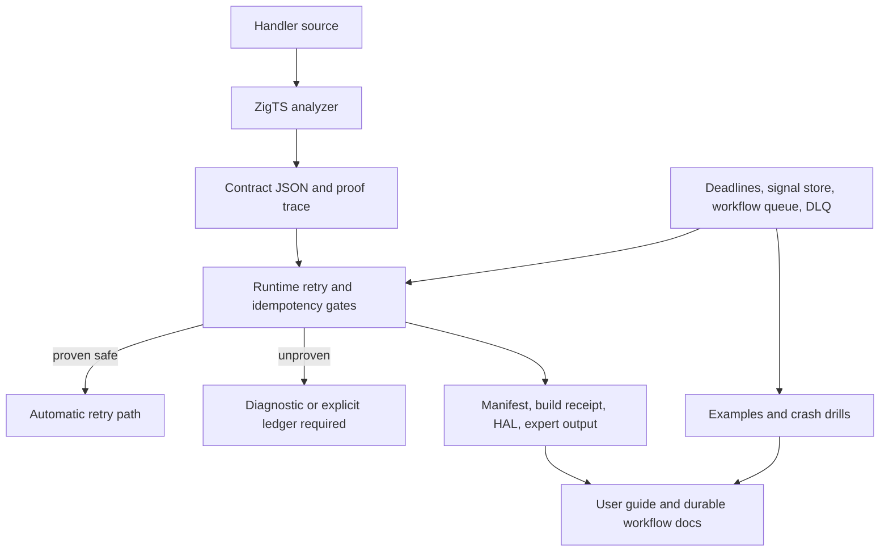

# Complete Workflow & Fault Tolerance - Plan

## Implementation Status

This plan is a decision record for the workflow/fault-tolerance work, not an
open backlog. As of `82d4494b`, U1-U7 and the runtime part of U8 have landed:
durable deadlines and fetch retries respect step deadlines, workflow queue
encoding and the idempotency ledger are split into focused modules,
dead-lettered children suspend and can be replayed, orphaned reclaim files are
recovered, and proof-gated durable retry/reuse fails closed unless proof or a
matching `Idempotency-Key` ledger entry permits it.

Do not use the implementation units below as new runtime work. Release closeout
is limited to keeping release notes and public docs aligned with the landed
semantics, then re-running the verification gates.

## Goal Capsule

Complete Zigttp's workflow and fault-tolerance work so durable execution is not just available, but proven, replay-safe, operable after crashes, and clearly documented.

The product anchor is the current Strategy: solo developers should be able to let AI write serverless handlers while Zigttp gives them compile-time and runtime evidence about safety, determinism, and deployment behavior.
For this plan, "fault tolerant" means the durable workflow surface has honest semantics across retry, timeout, crash recovery, signals, queue dispatch, receipts, and docs.

Execution profile:

- **Depth**: Deep.
- **Mode**: Implementation-ready code plan.
- **Primary surface**: runtime durability, workflow queue, durable signal store, proof contracts, receipts, examples, and docs.
- **Stop conditions**: do not introduce automatic destructive retention, do not weaken proof soundness, do not break persisted replay names such as `workflow.parallel#N`, and do not make saga queue support appear supported before it is actually proven.
- **Tail ownership**: the final unit closes docs, examples, crash drills, and repo gates so the work does not end with unverified primitives.

## Product Contract

### Summary

This plan covers the full brainstorm scope: finish the workflow/fault-tolerance capability that already exists in pieces, make the proof system the authority for retry and idempotency claims, and close the testing/docs gaps around crash behavior.
It deliberately treats adjacent `zigttp:queue` actor work as a boundary to document, not as a durable-workflow persistence target.

The plan resolves the open brainstorm questions conservatively:

- Deadline cancellation lands first at fetch, durable waits, sleeps, and other suspension points; general interpreter preemption is deferred.
- Idempotency and retry automation are gated by conservative proof properties and explicit runtime ledgers.
- Saga plus workflow queue remains a documented guardrail for this plan.
- Retention defaults are non-destructive; cleanup is explicit and inspectable.

### Problem Frame

Zigttp now has a broad workflow surface: durable runs, steps, sleeps, signals, fanout, follow, saga, workflow queue dispatch, durable fetch retry for transport failures, and proof/receipt foundations.
The remaining risk is that those pieces can look "done" while still being under-specified in the exact failure modes users care about: crashes between file moves, stuck signals, retry safety, timeout behavior, dead-letter handling, and proof receipts that do not explain the guarantee.

The desired outcome is a system where a user can inspect a handler and answer three questions without reading runtime internals:

- Will this workflow retry safely?
- What happens if the process dies at the bad moment?
- Which guarantee is proven, which is runtime-enforced, and which is explicitly unsupported?

### Requirements

**Durable runtime behavior**

- **R1 - Existing workflow APIs stay first-class**: `workflow.call`, `workflow.follow`, `workflow.fanout`, `workflow.saga`, durable steps, sleeps, waits, signals, and durable fetch keep their current public role, with tests and docs describing their actual guarantees.
- **R2 - Deadlines become operational**: `stepWithTimeout` and workflow deadlines must interrupt or fail at supported blocking boundaries, not merely notice that a deadline passed after user code returns.
- **R3 - Retry policy becomes explicit**: durable fetch and recovery retry must preserve current 599/5xx retry behavior while adding bounded jitter and clear exhaustion behavior.
- **R4 - Workflow queue is crash-tolerant enough to operate**: queued child dispatch must survive partial writes, corrupt files, expired leases, concurrent reclaim, repeated failure, and dead-letter recovery without losing successful results or silently duplicating completed work.
- **R5 - Durable signals do not strand resumes**: immediate and scheduled signals must be hidden until due, consumed only after a persisted resume path exists, finalized after success, and inspectable or cleaned up without unsafe default deletion.

**Proof-first fault tolerance**

- **R6 - Proof properties are conservative**: `retry_safe`, `idempotent`, and fault-coverage claims default to false when the analyzer cannot prove them.
- **R7 - Runtime automation obeys proofs**: automatic retry and idempotency shortcuts must require proven properties or an explicit idempotency ledger; unproven automatic retry should fail closed with actionable diagnostics while normal manual execution remains possible.
- **R8 - Receipts explain the guarantee**: deploy manifests, proof traces, HAL/expert outputs, and build receipts must surface the relevant workflow/fault-tolerance properties so users can tell what was proven and what was only configured.

**User-facing completion**

- **R9 - Queue/saga boundaries are honest**: saga under workflow queue remains rejected and documented in this plan; lifting that limitation requires separate proof and runtime design.
- **R10 - Actor queue remains adjacent**: `zigttp:queue` continues to be documented as a process-local actor mailbox with retries/dead letters, not as the durable workflow guarantee.
- **R11 - Examples and docs make crash behavior reproducible**: the repo must include workflow examples, mock fixtures, a first durable-workflow tutorial, and a crash drill that exercise the shipped behavior.

### Success Criteria

- A workflow author can use durable steps, wait for signals, fanout/follow, and workflow queue dispatch with docs that state the real crash and retry semantics.
- `stepWithTimeout` has meaningful tests for timeout during supported blocking operations.
- Workflow queue tests cover crash recovery, partial/corrupt state, concurrent reclaim, max-attempt-to-dead-letter, and replay from dead letter.
- Signal tests cover consume/finalize crash windows, scheduled visibility, corrupt files, and cleanup/inspection behavior.
- Proof JSON, receipts, and expert/HAL output expose conservative retry/idempotency/fault-coverage properties.
- Runtime retry/idempotency behavior is gated by proofs or explicit ledgers.
- Examples and docs run through the repo's verification scripts.

### Scope Boundaries

In scope:

- Hardening current durable/workflow primitives.
- Adding proof-derived retry/idempotency/fault-coverage properties where the existing analyzer can prove them conservatively.
- Runtime gates and ledgers that consume those properties.
- Workflow queue dead-letter inspection/replay and explicit cleanup/retention behavior.
- Documentation, examples, and repo verification for the workflow/fault-tolerance surface.

Out of scope:

- General-purpose interpreter preemption for arbitrary CPU-bound user code.
- Full saga execution through `--workflow-queue`.
- Durable persistence for the process-local `zigttp:queue` actor module.
- Hosted/cloud workflow orchestration.
- Automatic default pruning that deletes durable history or queue state without an explicit operator action.
- Full Node/V8 fidelity or broad JavaScript runtime expansion.

### Sources

The plan is grounded in the current checkout:

- `STRATEGY.md` frames the product as proof-first, AI-assisted serverless development.
- `packages/runtime/src/durable_executor.zig` has durable steps, sleeps, signals, and `stepWithTimeout`, with timeout currently checked after the body returns.
- `packages/runtime/src/runtime_http.zig` already retries durable fetch on transport failure as synthetic 599 and server errors.
- `packages/runtime/src/workflow_queue.zig` has pending/leased/done/dead lanes and lease reclaim, but only narrow queue tests.
- `packages/runtime/src/durable_store.zig` documents the current signal claim/resume crash window.
- `packages/runtime/src/runtime_workflow.zig` already rejects saga under workflow queue and preserves `workflow.parallel#N` step names for replay compatibility.
- `packages/zigts/src/contract_types.zig` already models durable workflow nodes, edges, and proof level.
- `docs/user-guide.md` and `docs/virtual-modules/README.md` describe the current workflow, durable, and queue surfaces but do not yet provide the tutorial/crash-drill level guide.

## Planning Contract

### Product Contract Preservation

This plan reorganizes the brainstorm into stable requirements and implementation units without narrowing the intended product outcome.
The only scope decisions added by planning are conservative resolutions to the brainstorm's open questions: suspension-point deadlines first, proof-gated idempotency first, saga queue support deferred, and no destructive retention default.

### Key Technical Decisions

- **KTD1 - Proof first, runtime second**: runtime conveniences such as automatic retry must consume proof properties instead of becoming an independent source of truth.
- **KTD2 - Deadline boundary**: implement cancellation at durable suspension points and outbound fetch/watchdog boundaries first; arbitrary CPU-bound interpreter preemption is deferred.
- **KTD3 - Retry jitter**: use bounded jitter for durable fetch and recovery backoff while preserving existing retry classification for synthetic 599 and 5xx statuses.
- **KTD4 - Signal consume protocol**: close the documented claim/resume crash window by persisting the resume intent before removing or hiding the signal from the available queue.
- **KTD5 - Queue dead letters**: repeated queue dispatch failure moves work to an inspectable dead-letter lane with explicit replay or discard commands.
- **KTD6 - Saga queue guardrail**: keep the current saga-under-queue rejection as a tested, documented guardrail; queue-addressable saga compensation is future work.
- **KTD7 - Retention safety**: add inspection and explicit cleanup controls, but do not introduce default background deletion of durable state.
- **KTD8 - Replay compatibility**: preserve response-part replay, `workflow.parallel#N` internal step keys, `workflow.follow` receipt alignment, and portable `system_hash` identity.
- **KTD9 - Actor queue boundary**: keep `zigttp:queue` as process-local actor messaging; do not blend its semantics with durable workflow state.

### High-Level Technical Design

The runtime and proof layers meet through a small set of explicit properties:

- `retry_safe`: automatic retry will not repeat non-idempotent side effects.
- `idempotent`: repeated execution of the same durable operation can be collapsed by key.
- `fault_covered`: the workflow has a known durable recovery path for the effects it uses.
- `durable_workflow_proof_level`: the durable graph is complete enough for receipts and expert output to make a strong claim.

The file-backed runtime surfaces share one rule: data can move from available to in-progress only when there is a durable recovery path back to either completion, retry, or operator-visible dead letter.

### System-Wide Impact

- Runtime persistence paths gain more validation, retry metadata, dead-letter operations, and tests.
- Proof contract JSON may gain or tighten fields, so parser/writer fixtures and compatibility tests must move together.
- Receipts and expert output gain new user-visible guarantee text.
- Docs and examples become part of the completion gate, not post-work cleanup.
- Existing replay data must remain compatible for `workflow.parallel#N`, response part snapshots, and durable run identity.

### Risks

- **False proof positives**: any analyzer uncertainty must produce false or partial, not a confident guarantee.
- **Double delivery**: signal and queue changes must prefer visible retry/dead-letter over hidden duplicate completion.
- **Data loss**: retention and cleanup work must be explicit and tested before deleting durable files.
- **Replay breakage**: renaming existing durable step keys or response snapshot formats would break existing oplogs.
- **Long-running gates**: broad verification can be slow; implementation should keep focused tests close to each touched module before the full verify script.

## Implementation Units

### U1 - Durable Deadline and Retry Floor

**Goal**

Make current durable deadline and retry behavior operational and testable before adding higher-level proof gates.

**Requirements**

- Covers R2 and R3.
- Feeds R7 by making the runtime retry floor deterministic enough for proof-gated use.

**Files**

- `packages/runtime/src/durable_executor.zig`
- `packages/runtime/src/runtime_http.zig`
- `packages/runtime/src/durable_recovery.zig`
- `packages/runtime/src/zruntime.zig`

**Approach**

- Replace post-body-only `stepWithTimeout` behavior with supported-boundary timeout behavior for durable sleeps, wait-signal, and outbound fetch.
- Thread deadline information through existing durable execution context instead of adding a global timer.
- Add a shared bounded-jitter helper for durable fetch retry and recovery polling/backoff.
- Preserve synthetic 599 retry classification for transport errors and preserve 5xx retry behavior.
- Keep unsupported CPU-bound preemption explicit in docs and diagnostics.

**Tests**

- `stepWithTimeout` times out a durable sleep before the sleep completes.
- `stepWithTimeout` times out `waitSignal` without consuming a later signal.
- Durable fetch retries synthetic 599 and 5xx with bounded delays and stops after exhaustion.
- Recovery retry backoff applies jitter without exceeding the configured cap.
- A CPU-bound body remains documented unsupported behavior rather than pretending to be preempted.

### U2 - Workflow Queue Reliability and Dead-Letter Operations

**Goal**

Move workflow queue from happy-path queueing plus lease reclaim to an operable crash-tolerant dispatch surface.

**Requirements**

- Covers R4, R9, and part of R11.

**Files**

- `packages/runtime/src/workflow_queue.zig`
- `packages/runtime/src/runtime_workflow.zig`
- `packages/runtime/src/runtime_cli.zig`
- `packages/runtime/src/cli_help.zig`
- `packages/runtime/src/zruntime.zig`

**Approach**

- Extend queue item metadata with attempt count, last error, lease owner, and timestamps needed for dead-letter decisions.
- Keep pending, leased, done, and dead lanes, but harden each file move with temp-file plus rename discipline.
- Move repeated failures or corrupt unrecoverable items to dead letter instead of spinning forever.
- Add a workflow-queue command group through the existing runtime CLI for listing dead letters, replaying a dead item, and discarding one item.
- Keep saga-under-queue rejection as a first-class tested branch.

**Tests**

- Queue item survives partial write by quarantine or rejection without poisoning the lane.
- Corrupt pending and leased files become visible operator failures.
- Two workers racing to reclaim one expired lease result in one claimant.
- Max attempts move a child request to dead letter with last error preserved.
- Replaying a dead item returns it to pending without losing the original idempotency key.
- Saga under workflow queue returns the documented guardrail.

### U3 - Durable Signal Queue Hardening

**Goal**

Close the signal claim/resume crash window documented in the current store and make scheduled signal behavior inspectable.

**Requirements**

- Covers R5 and contributes to R11.

**Files**

- `packages/runtime/src/durable_store.zig`
- `packages/runtime/src/durable_executor.zig`
- `packages/runtime/src/zruntime.zig`

**Approach**

- Persist the waiter's resume intent before hiding or removing the signal from the available queue.
- Finalize consumed signals only after the resumed workflow step is durably recorded.
- Keep scheduled signals invisible until due.
- Add explicit inspection and cleanup helpers for old consumed/torn/quarantined signal files.
- Avoid default background deletion.

**Tests**

- Crash after signal claim but before resume persistence leaves the signal recoverable.
- Crash after resume persistence but before finalize does not double-deliver.
- Scheduled signals remain hidden until due.
- Torn or corrupt signal files move to quarantine.
- Cleanup only removes files selected by explicit operator action or test-controlled retention settings.

### U4 - Conservative Proof Property Derivation

**Goal**

Teach the proof layer to emit useful retry/idempotency/fault-coverage claims without overstating what the analyzer knows.

**Requirements**

- Covers R6 and prepares R7/R8.

**Files**

- `packages/zigts/src/contract_types.zig`
- `packages/zigts/src/contract_builder.zig`
- `packages/zigts/src/contract_json_writer.zig`
- `packages/zigts/src/contract_json_parser.zig`
- `packages/zigts/src/flow_checker.zig`
- `packages/zigts/src/proof_trace.zig`
- `packages/zigts/src/system_linker.zig`
- `packages/zigts/src/handler_contract.zig`

**Approach**

- Reuse existing durable workflow node/edge modeling for step, timeout, sleep, wait signal, signal, and response return.
- Derive `retry_safe`, `idempotent`, and `fault_covered` from known durable effects and explicit idempotency keys.
- Treat unknown native calls, dynamic names, unmodeled side effects, and unsupported workflow combinations as false or partial.
- Keep JSON parser/writer compatibility explicit with fixture updates.
- Add proof-trace reasons for both positive and negative claims.

**Tests**

- A simple durable step with a stable key is marked idempotent/retry-safe.
- A dynamic side-effecting call is not marked retry-safe.
- A workflow using `waitSignal` has a fault-coverage claim only when its resume path is modeled.
- Saga under queue does not get a complete durable proof.
- Contract JSON round-trips new fields and defaults missing fields conservatively.

### U5 - Runtime Proof-Gated Retry and Idempotency Ledger

**Goal**

Connect proof properties to runtime behavior so the system fails closed when a workflow is not proven safe.

**Requirements**

- Covers R7 and reinforces R2-R6.

**Files**

- `packages/runtime/src/durable_executor.zig`
- `packages/runtime/src/durable_store.zig`
- `packages/runtime/src/runtime_workflow.zig`
- `packages/runtime/src/zruntime.zig`
- `packages/zigts/src/modules/workflow/durable.zig`

**Approach**

- Load or pass proof properties into the runtime boundary that decides automatic retry.
- Require `retry_safe` for automatic durable retry unless the call provides an explicit idempotency key backed by a durable ledger.
- Store ledger entries using the same fsync/rename discipline as other durable state.
- Return clear diagnostics for unproven retry attempts.
- Keep manual user retry possible when no automatic guarantee is claimed.

**Tests**

- Proven retry-safe workflow retries automatically.
- Unproven workflow does not auto retry and returns a diagnostic.
- Explicit idempotency key collapses duplicate durable work.
- Ledger crash between write and finalize recovers to either completed value or retry-visible state.
- Replay of old oplogs without proof properties defaults to safe false behavior.

### U6 - Receipts, HAL, and Expert Surfacing

**Goal**

Make workflow/fault-tolerance guarantees visible in the artifacts users already inspect.

**Requirements**

- Covers R8 and contributes to R11.

**Files**

- `packages/tools/src/deploy_manifest.zig`
- `packages/runtime/src/attest/build_receipt.zig`
- `packages/runtime/src/attest/header_strings.zig`
- `packages/zigts/src/hypermedia_receipt.zig`
- `packages/zigts/src/contract_json_writer.zig`
- `packages/zigts/src/proof_trace.zig`
- `packages/pi/src/proof_enrichment.zig`
- `packages/pi/src/expert_workflow.zig`
- `packages/tools/tests/fixtures/expert/`

**Approach**

- Add workflow fault-tolerance properties to manifest/receipt surfaces without making them the product headline.
- Include concise negative reasons in expert/HAL output when a guarantee is partial or absent.
- Keep `system_hash` identity stable and portable.
- Update golden fixtures together with schema changes.

**Tests**

- Build receipt includes durable workflow proof level and retry/idempotency status.
- HAL/expert output says when retry safety is unproven and why.
- Manifest schema round-trips workflow properties.
- Golden fixtures update only for intentional user-visible changes.

### U7 - Workflow Examples, Fixtures, and Docs

**Goal**

Turn the runtime/proof behavior into runnable examples and user-facing documentation.

**Requirements**

- Covers R1, R9, R10, and R11.

**Files**

- `examples/workflow/`
- `scripts/test-examples.sh`
- `docs/user-guide.md`
- `docs/virtual-modules/README.md`
- `docs/durable-workflows.md`
- `docs/tutorials/first-durable-workflow.md`
- `docs/reliability.md`
- `docs/cli.md`

**Approach**

- Add deterministic workflow example fixtures for durable step, fanout, follow, wait signal, queued child dispatch, timeout, and dead-letter replay.
- Extend the example test script to run workflow fixtures.
- Add a durable workflows guide that explains proof vs runtime guarantees.
- Add a first-workflow tutorial with a crash drill.
- Document the `zigttp:queue` actor boundary separately from durable workflow queue semantics.
- Keep saga queue behavior documented as unsupported for now.

**Tests**

- Example fixtures run through `scripts/test-examples.sh`.
- Docs mention new CLI/runtime behavior and stay consistent with generated help.
- Crash drill instructions are reproducible from a clean checkout.
- No doc claims automatic cleanup or saga queue support that the runtime does not provide.

### U8 - Verification Gate and Release Readiness

**Goal**

Make the implementation complete only when focused tests, examples, docs, and repo-wide gates agree.

**Requirements**

- Covers all requirements as the closing unit.

**Files**

- `build.zig`
- `scripts/verify.sh`
- `scripts/test-examples.sh`
- `docs/plans/2026-06-30-001-feat-workflow-fault-tolerance-plan.md`

**Approach**

- Add or update test steps only when existing gates do not already cover the new workflow fixtures.
- Run focused tests after each unit and the full verification script before final commit.
- Keep this plan updated if implementation discovers a scope conflict.
- Record any deliberately deferred behavior in docs rather than leaving it implicit.

**Tests**

- Focused unit tests from U1-U7 pass.
- Example fixtures pass.
- Docs drift and link checks pass.
- Full repo verification passes.

## Verification Contract

Run focused gates during implementation, then close with the aggregate gates.

| Gate | Command |
|---|---|
| Format | `zig fmt --check build.zig packages/` |
| Runtime workflow tests | `zig build test-zruntime` |
| ZigTS/proof tests | `zig build test-zigts` |
| CLI tests | `zig build test-cli` |
| Examples | `bash scripts/test-examples.sh` |
| Docs | `zig build test-docs-drift test-doc-links` |
| Full verification | `bash scripts/verify.sh` |
| Diff hygiene | `git diff --check` |

Manual drills to keep with the implementation branch:

- Start a durable workflow with `--durable` and `--workflow-queue`, kill the process after child dispatch is leased, restart, and confirm the child either completes once or lands in dead letter.
- Trigger a waiting workflow signal, crash before finalize, restart, and confirm the workflow resumes once.
- Compile a proven retry-safe handler and an unproven side-effecting handler, then confirm runtime retry behavior differs and receipts explain why.

If a full gate is too slow during an intermediate unit, run the focused command for the touched package first and leave `bash scripts/verify.sh` for the closing unit.

## Definition of Done

- R1-R11 are implemented, tested, and documented; only items already listed under Scope Boundaries may remain deferred.
- U1-U8 focused tests pass.
- `bash scripts/verify.sh`, `zig build test-docs-drift test-doc-links`, and `git diff --check` pass before final commit.
- Receipts, proof output, and docs agree on retry/idempotency/fault-coverage wording.
- Workflow queue dead letters and signal cleanup are explicit operator actions, not hidden deletion.
- Saga under workflow queue remains rejected, tested, and documented.
- No persisted replay key, response-part snapshot format, or `system_hash` behavior is changed without a compatibility note.
- The final commit includes the plan update, code, tests, examples, and docs needed to make the feature reviewable end to end.
