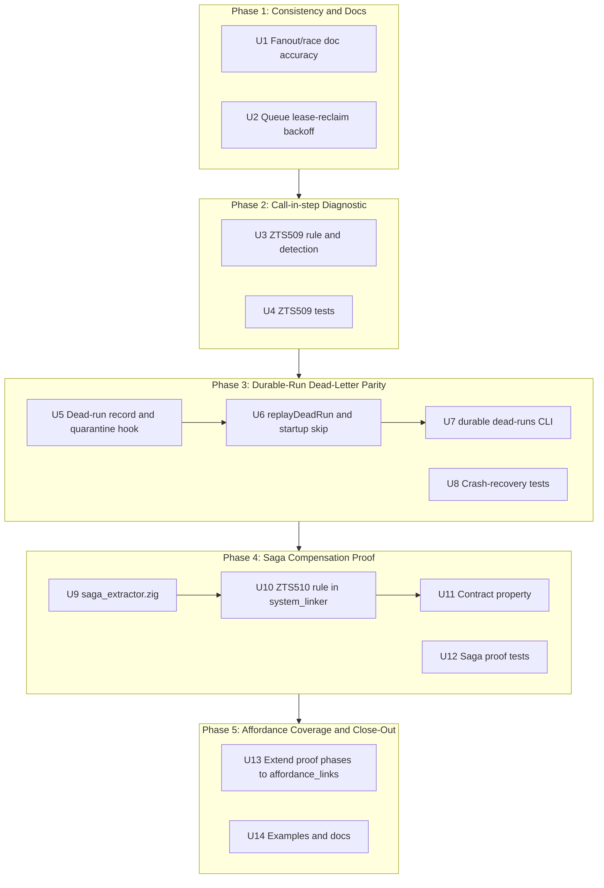

# Close Workflow & Fault-Tolerance Gaps - Plan

## Goal Capsule

Close every gap identified in
`docs/plans/2026-07-02-001-decision-workflow-fault-tolerance-gaps.md` so the
workflow/fault-tolerance surface landed by the 2026-06-30 plan has no known
silent-failure or misleading-semantics hole left before further work builds
on top of it.

Execution profile:

- **Depth**: Deep.
- **Mode**: Implementation-ready code plan.
- **Primary surface**: durable-run crash recovery, the analyzer's
  effect/diagnostic pipeline, `system_linker`'s cross-handler proof phases,
  workflow examples and docs.
- **Stop conditions**: do not weaken proof soundness, do not break persisted
  replay names or oplog formats, no automatic destructive retention, do not
  attempt to lift the existing saga vs. `--workflow-queue` rejection, do not
  expand `fanout()`/`race()` into genuine concurrency in this pass
  (deferred — see Scope Boundaries).
- **Tail ownership**: the final phase closes examples and docs so nothing
  from this plan ships undocumented.

## Product Contract

### Summary

This plan formalizes the three ranked gaps and six minor findings from the
2026-07-02 decision record into concrete requirements and implementation
units, sequenced by risk: documentation/consistency fixes first, the
self-contained analyzer diagnostic second, the crash-recovery-touching
dead-letter work third, the new saga proof surface fourth, and
affordance-proof-coverage plus docs close-out last.

### Problem Frame

Three user-confirmed design forks resolved scope before planning began:

- Durable-run dead-letter parity gets its **own `durable dead-runs` CLI
  namespace**, not a merge with `workflow-queue`'s dead-letter surface.
- `workflow.call`/`saga`/`fanout`/`follow` nested inside `step()` gets a
  **hard compile-time rejection**, not new runtime support for nested
  durability.
- The saga compensation-exhaustiveness proof covers **static do/undo sets
  only**; dynamically-constructed sagas fall back to unproven, matching the
  existing `intent.dynamic = true` escape hatch.

### Requirements

- **R1 - Fanout/race semantics are documented accurately**: `fanout()`'s
  sequential-but-order-deterministic dispatch and `race()`'s
  first-in-declaration-order (not lowest-latency) selection must be stated
  explicitly in user-facing docs, not just internal code comments.
- **R2 - Workflow-queue lease reclaim uses bounded jitter**: reclaim retries
  must back off the same way durable-run recovery already does, instead of
  retrying with no delay.
- **R3 - Nested workflow calls fail closed**: `workflow.call`, `saga`,
  `fanout`, and `follow` used inside a `durable.step()` callback must fail
  the build with a diagnostic instead of silently downgrading durability.
- **R4 - Durable-run failures are inspectable**: a durable run that
  permanently fails recovery must be persisted to an inspectable dead-run
  record with `list`/`replay`/`discard` operations, mirroring
  `workflow_queue`'s existing dead-letter API, without mutating the
  original oplog.
- **R5 - Saga compensation coverage is proven where decidable**: a
  statically-constructed `saga([...])` array must be proven at compile time
  to have a `compensate` on every step except possibly the last; a
  dynamically-constructed saga is marked unproven, never guessed.
- **R6 - HATEOAS affordance links get the same proof coverage as ordinary
  links**: payload-compatibility, cross-boundary/injection, and
  failure-cascade/retry-safety checks must also run over `affordance_links`,
  not only `links`.
- **R7 - Examples and docs stay current**: `examples/workflow/` gains
  coverage for `scope`/`using`/`ensure`, `signalAt`, queued `fanout`, and a
  saga-compensation-failure path; docs describe every new CLI verb,
  diagnostic, and contract property this plan adds.

---

## Planning Contract

### Product Contract Preservation

This plan carries forward Options A, B, and C from
`docs/plans/2026-07-02-001-decision-workflow-fault-tolerance-gaps.md`
without narrowing them, plus the six minor findings that decision record
left unscored. The three user-confirmed scope forks above are additions,
not conflicts, with that record.

### Key Technical Decisions

- **KTD1 - Dead-run record is the first durable representation of
  quarantine state**: `durable_recovery.zig`'s `RetryTracker` is in-memory
  only (`std.StringHashMapUnmanaged`), so today a process restart silently
  resets a run's failure count and re-attempts it. Writing a persisted
  record at the moment `quarantine_threshold` (10) is crossed makes
  quarantine durable across restarts for the first time: the recovery
  poller must check for an existing dead-run record before attempting a
  run, not rely on the in-memory tracker alone.
- **KTD2 - Dead-run records live alongside, not inside, the oplog**: new
  records go in a sibling `dead-runs/` directory keyed by the oplog
  filename, mirroring `workflow_queue`'s `<durable_dir>/workflow-queue/dead/`
  layout. The oplog file itself is never renamed, mutated, or deleted by
  this plan — required by the hypothesis canvas's kill criterion and the
  2026-06-30 plan's replay-compatibility stop condition.
- **KTD3 - New small module, not a bigger existing file**: dead-run
  persistence gets its own `durable_dead_runs.zig` (record shape, atomic
  write, list/read/replay/discard) and `durable_dead_runs_cli.zig` (CLI
  verbs), mirroring how `workflow_queue.zig` and `workflow_queue_cli.zig`
  are already split, rather than growing `durable_recovery.zig` further.
- **KTD4 - Diagnostic codes**: the highest ZTS5xx code in use is ZTS508.
  The new call-in-step diagnostic takes **ZTS509**; the new saga
  compensation diagnostic takes **ZTS510**.
- **KTD5 - Call-in-step detection reuses existing state**:
  `effect_inference.zig` already tracks `durable_callback_depth` to know
  when the walk is inside a `durable.step()` callback (used today only to
  suppress a non-determinism check). ZTS509 reuses that counter — no new
  "inside step()" tracking is needed.
- **KTD6 - Saga proof scope is structural, not effect-level**: the proof
  checks only whether a `compensate` key is *present* on every non-last
  static step, not whether an existing `compensate` correctly undoes its
  `run`. Full side-effect analysis of step bodies is out of scope for this
  pass (see Scope Boundaries). The "last step may omit `compensate`" rule
  matches the existing `saga-orchestrator.ts` example (`ship` is last and
  has no compensate, by design) and avoids false positives against that
  legitimate pattern.

### High-Level Technical Design

Phases are sequenced by risk, not by strict code dependency: Phase 1 and
Phase 2 have no dependency on Phase 3 or 4 and could run in either order,
but documentation/consistency fixes are cheapest to land first and the
self-contained analyzer diagnostic (Phase 2) is lower-risk than the
crash-recovery-touching work (Phase 3). Phase 4 depends on nothing from
Phase 3 but is sequenced after it because it is the largest, most novel
unit of work. Phase 5's U13 is independent of Phases 1-4; U14 documents the
cumulative result of all prior phases, so it must go last.

### System-Wide Impact

- `durable_recovery.zig` gains a new persisted side channel (dead-run
  records) alongside its existing in-memory `RetryTracker`.
- The analyzer's `effect_inference.zig` / `rule_registry.zig` /
  `contract_types.zig` gain two new diagnostics (ZTS509, ZTS510) and a new
  `SagaInfo` contract field.
- `system_linker.zig`'s proof phases (payload, cross-boundary, failure
  cascade) extend to a second link list (`affordance_links`).
- `contract.json` gains a new saga compensation-coverage property,
  following the existing `durable.workflow.properties` convention.
- The CLI gains a new `durable dead-runs` command group.
- `examples/workflow/` and `docs/durable-workflows.md` gain new coverage;
  existing docs get corrected concurrency-semantics language for
  `fanout()`/`race()`.

### Risks

- **Crash-recovery fragility**: `durable_recovery.zig` has a documented
  prior double-free bug that was invisible under `test-zruntime`'s
  arena-wrapped allocator and only caught under `test-cli`'s fresh-GPA
  runner. Phase 3 tests must run under the latter.
- **False proof positives (saga)**: an overly aggressive static check could
  flag legitimate patterns (e.g., a trailing no-compensate step). Mitigated
  by KTD6's explicit last-step exception and a negative test matching the
  existing `saga-orchestrator.ts` example.
- **Restart semantics change**: KTD1 means a restarted process no longer
  silently forgets quarantine state. This is an intentional behavior
  improvement, but it changes observable behavior after a crash and should
  be called out in docs (U14), not just shipped silently.
- **Diagnostic false positives (ZTS509)**: the check must not fire for
  top-level `call()`/`saga()`/`fanout()`/`follow()` usage outside any
  `step()`, nor for `workflow.call` nested inside an unrelated, non-durable
  helper function. Covered by U4's negative test cases.

---

## Implementation Units

### Phase 1: Consistency and Documentation Fixes

#### U1 - Accurate fanout()/race() concurrency semantics

**Goal**

Eliminate the naming/behavior mismatch by documenting what `fanout()` and
`race()` actually do, and cross-reference the two mismatched concurrency
caps, without changing runtime behavior in this unit.

**Requirements**

- Covers R1.

**Files**

- `packages/runtime/src/runtime_workflow.zig`
- `packages/zigts/src/modules/workflow/io.zig`
- `docs/durable-workflows.md`

**Approach**

- Expand the existing internal comments at `runtime_workflow.zig:835`
  (`MAX_PARALLEL_CALLS = 16`, sequential dispatch) and `io.zig:16`/`:27`
  (`MAX_PARALLEL = 8`, `race()` join-then-scan) into doc comments that state
  the user-visible behavior plainly: `fanout()` dispatches sequentially and
  is order-deterministic by declaration index, not concurrent; `race()`
  returns the first success in declaration order, not the lowest-latency
  response.
- Add a one-line cross-reference in each constant's comment noting the
  other constant and why they differ: `MAX_PARALLEL_CALLS` bounds a
  sequential dispatch loop (no concurrent OS threads), `MAX_PARALLEL` bounds
  actual concurrent fetches — they are not required to match.
- Add the same plain-language behavior notes to `docs/durable-workflows.md`
  wherever `fanout`/`race` are documented, with a pointer to the Scope
  Boundaries section below for the deferred concurrency work.

**Tests**

- Test expectation: none — documentation and comment changes only, no
  behavior change.

#### U2 - Workflow-queue lease-reclaim backoff and jitter

**Goal**

Give `workflow_queue.zig`'s lease-reclaim retries the same bounded,
jittered backoff `durable_recovery.zig` already uses for recovery retries,
instead of retrying immediately with no delay.

**Requirements**

- Covers R2.

**Files**

- `packages/runtime/src/workflow_queue.zig`
- `packages/runtime/src/retry_backoff.zig`

**Approach**

- In `handleLeasedFile` (~lines 299-333), replace the immediate
  `error.FileNotFound`-triggered retry with a delay computed via
  `retry_backoff.retryDelayMs(base_ms, max_ms, attempt, seed)`, the same
  helper `durable_recovery.zig` already calls.
- Size `base_ms`/`max_ms` for the 30-second lease window rather than
  reusing `durable_recovery`'s 1s-60s parameters verbatim — the reclaim
  race is expected to resolve in well under one lease period. Pick small,
  explicit constants (for example a sub-second base capped well below the
  lease duration) and document the choice in a comment next to the call.
- Reuse `retry_backoff.seedBytes` the same way `durable_recovery.zig` does
  for jitter seeding.

**Tests**

- Two workers racing to reclaim the same expired lease back off instead of
  spinning; the eventual claimant still succeeds within the lease window.
- Backoff delay never exceeds the configured cap.

---

### Phase 2: Compile-Time Rejection of Nested Workflow Calls

#### U3 - ZTS509 rule definition and detection

**Goal**

Fail the build when `workflow.call`, `saga`, `fanout`, or `follow` is used
inside a `durable.step()` callback, instead of silently losing durability
at runtime.

**Requirements**

- Covers R3.

**Files**

- `packages/zigts/src/rule_registry.zig`
- `packages/zigts/src/contract_types.zig`
- `packages/zigts/src/effect_inference.zig`
- `packages/zigts/src/spec_discharge.zig`

**Approach**

- Add a `SpecDiagnostic.Kind` variant (`contract_types.zig`) and matching
  `RuleEntry` (`rule_registry.zig`) for ZTS509, following the exact shape
  of the existing ZTS500 (`spec_not_discharged`) entry: code, description,
  example (`step(() => call("x", {}))`), help text pointing at moving the
  call outside `step()`, and a repair hint.
- In `effect_inference.zig`'s callee-resolution path (the same place
  `isDurableStepCall` already resolves `zigttp:durable`/`step`), add a
  check for `imported.module == "zigttp:workflow"` and `imported.name` in
  `{call, saga, fanout, follow}`. When `self.durable_callback_depth > 0` at
  that point, record the violation.
- Follow the existing ZTS5xx convention of a two-pass pipeline: have
  `effect_inference.zig` set a new `EffectRow` flag rather than emitting
  the diagnostic directly, then have `spec_discharge.zig` turn that flag
  into the ZTS509 `SpecDiagnostic` in its existing second pass — keeps
  `effect_inference.zig` a pure effect-computation pass, consistent with
  its current role.

**Tests**

- `step(() => call(...))`, `step(() => saga(...))`,
  `step(() => fanout(...))`, and `step(() => follow(...))` each produce
  ZTS509.
- Top-level (non-nested) `call()`/`saga()`/`fanout()`/`follow()` usage
  continues to pass unchanged — regression-test against every existing
  `examples/workflow/*.ts` file.
- `workflow.call` nested inside a plain, non-durable helper function (not a
  `step()` callback) does not trigger ZTS509.

#### U4 - ZTS509 negative/positive test matrix

**Goal**

Lock in the exact boundary of the new rule so future analyzer changes
cannot silently widen or narrow it.

**Requirements**

- Covers R3.

**Dependencies**

- U3.

**Files**

- Test blocks colocated with `effect_inference.zig` and `spec_discharge.zig`
  (per this repo's `test "..."`-block convention).

**Approach**

- Table-driven test covering: each of the four nested-call forms (fails),
  each at top level (passes), nested two levels deep inside a `step()`
  whose callback itself contains a nested non-durable helper that calls
  `workflow.call` (still fails — depth tracking must survive intermediate
  function boundaries the same way it already does for the existing
  non-determinism suppression check).

**Tests**

- See Approach — this unit *is* the test matrix.

---

### Phase 3: Durable-Run Dead-Letter Parity

#### U5 - Dead-run record persistence and quarantine hook

**Goal**

Persist a durable run's terminal failure state the moment it crosses
`RetryTracker.quarantine_threshold`, instead of only existing as ephemeral
in-process tracker state.

**Requirements**

- Covers R4.

**Files**

- `packages/runtime/src/durable_dead_runs.zig` (new)
- `packages/runtime/src/durable_recovery.zig`

**Approach**

- New file `durable_dead_runs.zig` defines a dead-run record (oplog
  filename, run key, quarantined-at timestamp, consecutive-failure count,
  and the concrete failure reason) and a `writeDeadRun` function using a
  local atomic tmp-write + fsync + rename, mirroring
  `workflow_queue.zig`'s private `writeFileAtomic` shape (KTD3).
- Records live at `<durable_dir>/dead-runs/<name-derived-from-oplog>.json`,
  a sibling of the oplog directory (KTD2) — never touching the oplog file.
- In `durable_recovery.zig`'s `recoverIncompleteOplogsTracked`, the
  `.failed` branch currently swallows the concrete error into the enum tag
  before calling `tracker.recordFailure`. Thread the actual error/reason
  string through so it can be captured in the record.
- Call `writeDeadRun` exactly once, at the transition where
  `recordFailure` first causes `shouldAttempt` to become false for that
  name (not on every subsequent poll) — a re-quarantine of an already
  dead-lettered run must be a no-op, not a duplicate write.

**Tests**

- Crossing `quarantine_threshold` writes exactly one dead-run record with
  the correct reason, run key, and timestamp.
- A run that fails 9 times then recovers never gets a record.
- Polling an already-quarantined run again does not rewrite or duplicate
  its record.
- The oplog file is byte-for-byte unchanged after quarantine.

#### U6 - replayDeadRun and startup skip-if-dead

**Goal**

Let an operator clear a dead-run record and have the run picked back up by
recovery from its existing oplog; make recovery-on-startup honor an
existing dead-run record even though the in-memory tracker resets on
restart (KTD1).

**Requirements**

- Covers R4.

**Dependencies**

- U5.

**Files**

- `packages/runtime/src/durable_dead_runs.zig`
- `packages/runtime/src/durable_recovery.zig`

**Approach**

- `replayDeadRun` deletes the persisted record and calls
  `tracker.clear(name)`, then leaves the untouched oplog for the next
  recovery poll to pick up naturally — no oplog mutation.
- `discardDeadRun` deletes the persisted record only, without touching the
  oplog. The run stays permanently unretried (matching today's silent
  behavior) but the operator's decision is now recorded and the record
  list stops showing it — consistent with the "explicit, inspectable
  cleanup" convention from the 2026-06-30 plan.
- `recoverIncompleteOplogsTracked` must check for an existing dead-run
  record before attempting a run — not just consult the in-memory
  `RetryTracker`, which is empty after a restart (KTD1). A run with a
  standing dead-run record is skipped until `replayDeadRun` removes it.

**Tests**

- `replayDeadRun` removes the record, resets the tracker, and the next
  recovery poll retries the run from the untouched oplog.
- `discardDeadRun` removes the record without touching the oplog; the run
  is not retried on the next poll.
- Simulated restart (fresh `RetryTracker`, existing dead-run record on
  disk) does not retry the quarantined run.
- `discardDead`/`replayDeadRun` on a non-existent record surfaces a clear
  error, not a silent no-op.

#### U7 - `durable dead-runs` CLI

**Goal**

Give operators `list`/`show`/`replay`/`discard` access to dead-run records,
mirroring `workflow-queue`'s existing dead-letter CLI exactly.

**Requirements**

- Covers R4.

**Dependencies**

- U5, U6.

**Files**

- `packages/runtime/src/durable_dead_runs_cli.zig` (new)
- `packages/runtime/src/dev_cli.zig`
- `packages/runtime/src/runtime_cli.zig`

**Approach**

- New `durable_dead_runs_cli.zig` mirrors `workflow_queue_cli.zig`'s exact
  shape: a `Command` enum (`list`, `show`, `replay`, `discard`, `help`),
  `Options`/`parseOptions` (`--durable <DIR>` plus positional id), and a
  `runWith(allocator, argv, stdout, stderr)` entry point.
- Wire a `durable` top-level command with a `dead-runs` sub-verb into
  `dev_cli.zig`/`runtime_cli.zig` following the identical
  `if (eql(command, "workflow-queue"))` dispatch pattern already used for
  `workflow-queue`.
- Match `workflow_queue_cli.zig`'s exit-code convention
  (`isExpectedUserError` → exit 1) so both dead-letter CLIs behave
  identically from a caller's perspective.

**Tests**

- `list` shows quarantined run IDs sorted, matching `listDeadIds`'s
  contract.
- `show` prints the record's reason/timestamp/failure-count.
- `replay`/`discard` route to U6's functions and surface their errors with
  the same formatting `workflow_queue_cli.zig` uses.

#### U8 - Crash-recovery regression tests under the fresh-GPA runner

**Goal**

Guarantee the new dead-run code path is exercised somewhere that would
actually catch a double-free or use-after-free, given the documented
history of exactly that bug class in this file.

**Requirements**

- Covers R4.

**Dependencies**

- U5, U6, U7.

**Execution note**: run these specific tests under `test-cli`'s
per-test-fresh GPA allocator, not `test-zruntime`'s arena-wrapped `Runtime`
fixture — the latter is documented to mask a double-free as a silent no-op.

**Files**

- Test blocks reachable from `packages/runtime/src/runtime_cli.zig`'s
  `test-cli` root (per the existing `durable_recovery.zig` precedent).

**Approach**

- Reuse the existing crash-recovery test fixture shape from
  `durable_recovery.zig`, extended to assert on dead-run record presence
  and content after simulated repeated failures.

**Tests**

- Full lifecycle under `test-cli`: 10 consecutive failures → record
  written → `replayDeadRun` → recovery succeeds → record gone; no
  allocator errors reported.

---

### Phase 4: Proven-Exhaustive Saga Compensation Coverage

#### U9 - `saga_extractor.zig`

**Goal**

Give the analyzer a compile-time model of a saga's steps for the first
time, reusing the literal-walk-or-bail discipline `intent_extractor.zig`
already established.

**Requirements**

- Covers R5.

**Files**

- `packages/zigts/src/saga_extractor.zig` (new)
- `packages/zigts/src/contract_types.zig`
- `packages/zigts/src/handler_contract.zig`

**Approach**

- Mirror `intent_extractor.zig`'s pattern: walk the `saga([...])` call
  site's argument as a literal. The argument must be an array literal of
  object literals, each with a literal `name` key and a `run` key present;
  `compensate` is optional per step.
- Any non-literal shape — spread, computed step, an identifier referencing
  steps built elsewhere, a conditional/loop-constructed array, or a
  non-literal `compensate` selection — immediately sets `dynamic = true`
  and clears any partially-collected steps, mirroring
  `intent_extractor.zig`'s `markDynamic` clear-then-flag invariant so a
  caller never sees a half-populated proof used as if sound.
- Add a `SagaInfo` struct (`steps: []{name: []const u8, has_compensate:
  bool}`, `dynamic: bool`) to `contract_types.zig` alongside the existing
  `IntentInfo`/`DurableInfo` fields, re-exported through
  `handler_contract.zig`.

**Tests**

- A fully static saga (matching `saga-orchestrator.ts`'s shape) extracts
  three steps with the correct `has_compensate` values.
- A saga built from a spread (`saga([...base, extraStep])`) is marked
  `dynamic = true` with an empty `steps` list.
- A saga referencing a step array built in a separate `const` binding is
  marked dynamic.

#### U10 - ZTS510 rule and system_linker check

**Goal**

Fail the build when a statically-analyzable saga has a non-last step
without a `compensate`, closing the partial-rollback hole Workstream B2
originally scoped.

**Requirements**

- Covers R5.

**Dependencies**

- U9.

**Files**

- `packages/zigts/src/rule_registry.zig`
- `packages/zigts/src/contract_types.zig`
- `packages/zigts/src/system_linker.zig`

**Approach**

- Add a ZTS510 `RuleEntry`/`SpecDiagnostic.Kind`, following the same
  template used for ZTS509.
- Place the actual check in `system_linker.zig`, not `fault_coverage.zig`
  — saga steps' `run`/`compensate` typically dispatch cross-handler via
  `call(name, ...)`, which `system_linker.zig` already resolves, and this
  keeps saga-step linkage in the file that already understands
  cross-handler edges.
- The check: for each handler's `SagaInfo` where `dynamic == false`, flag
  any step at index `< steps.len - 1` where `has_compensate == false`.
  Skip entirely when `dynamic == true` (KTD6/R5 — unproven, not failed).

**Tests**

- A static saga with a non-last step missing `compensate` fails ZTS510.
- A static saga where only the *last* step omits `compensate` passes
  (matches the existing `ship`-is-last pattern in `saga-orchestrator.ts`).
- A fully-covered static saga passes with no diagnostic.
- A dynamic saga (per U9) never fires ZTS510 regardless of shape.

#### U11 - Saga compensation-coverage contract property

**Goal**

Surface the proof verdict to receipts, `contract.json`, and `zigttp
verify`, the same way existing durable-workflow properties are surfaced.

**Requirements**

- Covers R5.

**Dependencies**

- U9, U10.

**Files**

- `packages/zigts/src/contract_types.zig`
- `packages/zigts/src/handler_contract.zig`

**Approach**

- Add a `saga.compensationProven` (or equivalently-named) boolean property
  to the contract, following the existing pattern documented in
  `docs/durable-workflows.md`'s "Proofs Vs Runtime Guarantees" section for
  `retrySafe`/`idempotent`/`faultCovered`: `true` only when `SagaInfo.dynamic
  == false` and ZTS510 did not fire; `false`/absent otherwise, never a
  guess.

**Tests**

- `contract.json` for a fully-covered static saga includes
  `saga.compensationProven: true`.
- `contract.json` for a dynamic saga omits the property or sets it
  `false`, never `true`.

#### U12 - Saga proof end-to-end tests

**Goal**

Verify the extractor, diagnostic, and contract property agree with each
other across the full saga shape space.

**Requirements**

- Covers R5.

**Dependencies**

- U9, U10, U11.

**Files**

- Test blocks colocated with `saga_extractor.zig` and `system_linker.zig`.

**Approach**

- End-to-end table test compiling small saga handlers through the full
  pipeline (extract → link → contract) for: fully covered, non-last-step
  gap, last-step-only gap (passes), and dynamic construction.

**Tests**

- See Approach — this unit *is* the end-to-end matrix.

---

### Phase 5: Affordance Coverage and Close-Out

#### U13 - Extend proof phases to `affordance_links`

**Goal**

Give HATEOAS affordance links the same payload/injection/retry-safety
proof coverage ordinary links already get.

**Requirements**

- Covers R6.

**Files**

- `packages/zigts/src/system_linker.zig`

**Approach**

- Phases C2 (payload, `analyzePayloadProof`), D (cross-boundary/injection),
  and E (failure cascade/retry-safety) currently iterate `links.items`
  only. Add a parallel iteration over `affordance_links.items` in each
  phase, reusing the same per-phase analysis functions rather than
  duplicating their logic.
- Sequence this after Phase 4 (U9-U12) since both touch
  `system_linker.zig` — implementing U13 after U10 minimizes diff overlap
  in the same file.

**Tests**

- A HATEOAS affordance link with an incompatible payload shape now fails
  the same payload-proof check an equivalent ordinary link would.
- A HATEOAS affordance link into a non-retry-safe target now fails the
  same failure-cascade check an equivalent ordinary link would.
- Existing `affordance_responses_covered` behavior (Phase A2b) is
  unchanged.

#### U14 - Examples and documentation close-out

**Goal**

Leave no new surface from this plan undocumented, and fill the
previously-identified example gaps.

**Requirements**

- Covers R7.

**Dependencies**

- U1-U13 (documents their cumulative result).

**Files**

- `examples/workflow/` (new example files)
- `docs/durable-workflows.md`

**Approach**

- Add example coverage for: `scope`/`using`/`ensure` usage, `signalAt`
  (existing `wait-signal-orchestrator.ts` only uses `signal`), queued
  `fanout` (the `--workflow-queue` + `fanout()` combination has no example
  today), and a saga-compensation-failure path (an example where the
  `compensate` thunk itself throws, distinct from the existing
  `saga-orchestrator.ts` success-then-rollback path).
- Document: the new `durable dead-runs` CLI (U5-U8), ZTS509 and ZTS510
  (U3, U10), the `saga.compensationProven` contract property (U11), the
  corrected `fanout()`/`race()` semantics (U1), and the restart-behavior
  change from KTD1 (a restarted process now honors standing dead-run
  records instead of silently forgetting quarantine state).

**Tests**

- Test expectation: none for docs. New example files must pass
  `bash scripts/test-examples.sh`, including the new saga-compensation-
  failure example asserting the compensation failure surfaces as the
  documented terminal 500.

---

## Scope Boundaries

### Deferred to Follow-Up Work

- **Genuine `fanout()` concurrency**: blocked on per-call runtime/
  interpreter context isolation — today's sequential dispatch relies on
  shared globals (`zruntime.current_runtime`, `interpreter.current_interpreter`,
  `http.call_function_callback`) that are swapped per call and are not
  safe to share across concurrent calls without a larger runtime change.
- **Genuine `race()` latency-based selection**: blocked on
  `execute_fetches_fn` exposing per-descriptor completion signaling
  (select/poll or a completion callback) instead of joining all threads
  before scanning for the first success.
- **Saga proof for dynamically-constructed do/undo sets**: only static
  arrays are proven in this pass (R5/KTD6); a saga built from spreads,
  conditionals, or externally-referenced step arrays stays unproven.
- **Saga effect-body analysis**: this pass proves structural presence of
  `compensate`, not whether an existing `compensate` correctly undoes its
  paired `run`. Verifying that would require full side-effect analysis of
  step bodies.
- **Saga vs. `--workflow-queue` reconciliation**: unchanged from the
  2026-06-30 plan's guardrail (KTD carried forward: R9 there, still out of
  scope here).
- **Hosted/cloud orchestration**: unchanged strategic exclusion
  (`STRATEGY.md`, `docs/roadmap.md`).

---

## Verification Contract

| Gate | Command |
|---|---|
| Format | `zig fmt --check build.zig packages/` |
| Runtime workflow tests | `zig build test-zruntime` |
| ZigTS/proof tests | `zig build test-zigts` |
| CLI tests (Phase 3, 7's `durable dead-runs`) | `zig build test-cli` |
| Examples | `bash scripts/test-examples.sh` |
| Docs | `zig build test-docs-drift test-doc-links` |
| Full verification | `bash scripts/verify.sh` |
| Diff hygiene | `git diff --check` |

Manual drills to keep with the implementation branch:

- Quarantine a durable run (force 10 consecutive recovery failures), kill
  and restart the process, confirm it stays quarantined until
  `zigttp durable dead-runs replay <id>` is run.
- Compile a handler with `step(() => call("x", {}))` and confirm ZTS509
  fails the build with an actionable message.
- Compile the existing `saga-orchestrator.ts` example unmodified and
  confirm it passes ZTS510 (last-step-no-compensate is allowed); then
  remove `compensate` from a non-last step and confirm ZTS510 fires.

If a full gate is too slow during an intermediate unit, run the focused
command for the touched package first and leave `bash scripts/verify.sh`
for the closing unit (U14).

## Definition of Done

- R1-R7 are implemented, tested, and documented; only items listed under
  Scope Boundaries may remain deferred.
- U1-U14 focused tests pass, with U8's tests specifically confirmed to run
  under `test-cli`'s fresh-GPA allocator, not `test-zruntime`'s
  arena-wrapped fixture.
- `bash scripts/verify.sh`, `zig build test-docs-drift test-doc-links`, and
  `git diff --check` pass before final commit.
- No persisted replay key, oplog format, or `system_hash` behavior is
  changed without a compatibility note (KTD2/stop condition).
- `durable dead-runs discard`/`replay` remain explicit operator actions;
  no automatic destructive retention is introduced (KTD2, carried from the
  2026-06-30 plan).
- Saga under `--workflow-queue` remains rejected, tested, and documented,
  unchanged from the 2026-06-30 plan.
- The restart-behavior change from KTD1 (standing dead-run records survive
  a process restart) is called out explicitly in docs (U14), not shipped
  silently.
- Every new CLI verb, diagnostic code, and contract property this plan
  introduces is documented in `docs/durable-workflows.md`.

## Sources & Research

- `docs/plans/2026-07-02-001-decision-workflow-fault-tolerance-gaps.md` —
  origin decision record; Options A/B/C and the six minor findings this
  plan formalizes.
- `docs/plans/2026-06-30-001-feat-workflow-fault-tolerance-plan.md` —
  predecessor plan; source of the stop conditions and KTD9-equivalent
  guardrails carried forward here.
- `docs/durable-workflows.md`, `docs/reliability.md` — existing
  proofs-vs-runtime-guarantees documentation convention followed by U11.
- `~/.claude/plans/zany-sniffing-pearl.md` (external, non-repo planning
  artifact, cited for provenance only — not a file to open during
  implementation) — Workstream B2's original one-line sketch of the saga
  compensation-coverage idea this plan's Phase 4 formalizes and implements.
