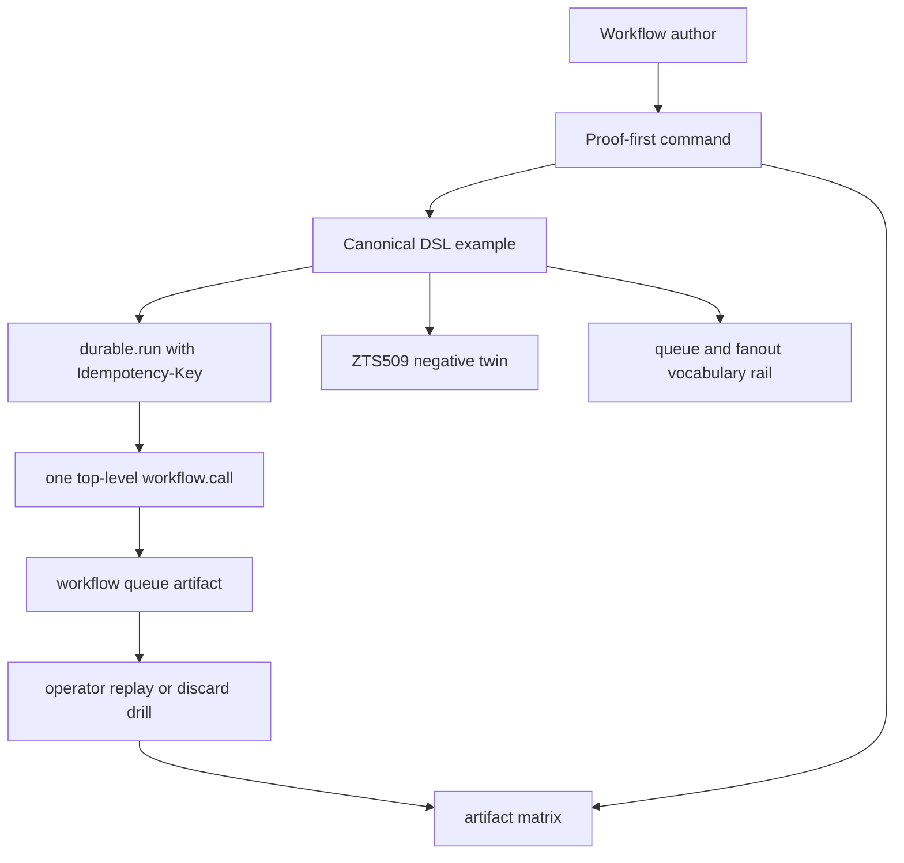

# ZigTS Embedded Workflow DSL Example - Plan

## Goal Capsule

- **Objective:** Define one canonical ZigTS durable workflow example that reads like an embedded workflow DSL: proof first, one durable run key, one queued child boundary, one deterministic recovery drill, one invalid twin, one artifact matrix, and one queue-disambiguation note.
- **Product authority:** The current product direction is proof-first, AI-assisted serverless development; this artifact should help a workflow author trust durable behavior without reading runtime internals.
- **Open blockers:** None for planning. Planning should verify exact CLI command names and proof JSON field names against the current checkout before implementation.

---

## Product Contract

### Summary

Build one canonical ZigTS workflow example that starts with a proof receipt, then runs a minimal durable workflow through one queued child call and one visible recovery path.
Supporting rails explain the grammar around the example: the invalid nested-call shape, the artifact and recovery matrix, the naming convention that makes the surface feel like a DSL, and the difference between workflow queue, actor queue, and ordered durable batch behavior.

### Problem Frame

Zttp now has durable runs, durable steps, queued workflow dispatch, proof diagnostics, dead letters, and replay paths, but the learning path is still split across primitive-focused examples and docs.
A new workflow author can see the APIs before seeing the smallest trustworthy shape that combines them.
The docs need a copyable story that shows what is proven, what is persisted, what can be recovered, and what shape the compiler rejects.

### Key Decisions

- **One durable story beats all-primitives breadth:** The first artifact should show exactly one run key, one child call, and one recovery path; saga, signals, fanout variants, and scheduled signals stay out of the first path.
- **Proof precedes runtime trust:** The first command in the workflow should produce the proof or contract receipt, and the prose should map each important field back to the code boundary that caused it.
- **Failure is bounded and inspectable:** The recovery rail should use one deterministic failure path with visible durable artifacts and explicit operator action, not generic "the runtime retries" language.
- **The DSL is naming discipline:** Run keys, child names, step names, signal names, proof boundaries, and artifact labels should form the authoring grammar without adding a new ZigTS API.
- **Queue vocabulary stays split:** `--workflow-queue` is persisted child dispatch for workflows, `zttp:queue` is process-local actor mailbox messaging, and `fanout` should be described as ordered durable batch grouping rather than real concurrency.

### Actors

- A1. Workflow author: copies the example, reads the proof output, and learns the correct durable boundary placement.
- A2. Runtime operator: runs the local drill, inspects the durable artifact, and triggers the recovery action.
- A3. Zttp maintainer: keeps the example, docs, and verification gates aligned with shipped workflow semantics.
- A4. Planning agent: turns this product contract into concrete file edits, tests, and commands without inventing new product behavior.

### Requirements

**Canonical workflow shape**

- R1. The example must center one runnable workflow that derives a durable run key from `Idempotency-Key`, enters `durable.run(key)`, and dispatches exactly one top-level `workflow.call` through the workflow queue.
- R2. The first copyable path must avoid saga, scheduled signals, queued fanout, and multi-child orchestration so the durable boundary shape stays obvious.
- R3. The example must name every durable boundary in a way that teaches the DSL vocabulary: run key, child name, step name when used, artifact name, and recovery action.
- R4. The prose must state that no new public workflow API is being introduced; the DSL is the disciplined composition of existing ZigTS workflow primitives.

**Proof and authoring feedback**

- R5. The first visible checkpoint must be a proof or contract receipt, not the live runtime request.
- R6. The proof section must map durable proof fields to specific authoring choices in the example, including retry safety, idempotency, durable workflow proof level, and fault coverage when those fields are present.
- R7. The artifact must include a negative twin that places `workflow.call` inside `durable.step()`, shows the ZTS509 rejection, and places the corrected top-level shape beside it.

**Fault-tolerance rail**

- R8. The runtime drill must demonstrate one deterministic failure and recovery path using the current workflow-queue dead-letter, parent-suspension, replay, or equivalent shipped surface.
- R9. The drill must show that completed durable work is not duplicated when the recovery action completes the workflow.
- R10. The artifact matrix must map each demonstrated fault to a trigger, persisted artifact, caller-visible result, operator action, and proof or idempotency condition.

**Queue and prose rail**

- R11. The queue-disambiguation note must separate persisted workflow queue behavior from the `zttp:queue` actor mailbox surface.
- R12. The note must describe `fanout` as ordered durable batch grouping and avoid implying true parallel execution.
- R13. The prose must state the important unsupported or deferred shapes: saga under workflow queue, workflow calls nested inside durable steps, actor queue as a durability substitute, and all-primitives orchestration as the first example.

**Verification and maintenance**

- R14. The final implementation must make the example and prose verifiable through the repo's existing docs/examples gates rather than relying on manual copy checks.
- R15. The final implementation must keep the example small enough that future maintainers can update it when proof field names, CLI command names, or queue semantics change.

### Key Flows

- F1. Proof-first authoring loop
  - **Trigger:** A workflow author opens the example.
  - **Actors:** A1, A3.
  - **Steps:** The author reads the pattern header, runs the proof or contract command, sees the durable workflow fields, then maps each field back to the example boundary.
  - **Outcome:** The author understands why the workflow is retry-aware before starting the server.
  - **Covered by:** R1, R3, R5, R6.

- F2. Minimal runtime path
  - **Trigger:** The author submits a request with an idempotency key.
  - **Actors:** A1, A2.
  - **Steps:** The workflow enters the durable run, dispatches one queued child, records the child result, and returns a completed response or replayed result according to the current runtime behavior.
  - **Outcome:** The author sees the smallest complete workflow shape.
  - **Covered by:** R1, R2, R4, R9.

- F3. Deterministic recovery drill
  - **Trigger:** The child path fails in the documented deterministic way.
  - **Actors:** A2.
  - **Steps:** The operator inspects the surfaced artifact, performs the documented recovery action, and reruns or resumes the parent workflow.
  - **Outcome:** The drill shows one concrete fault path from failure to recovery without blending in unrelated mechanisms.
  - **Covered by:** R8, R9, R10.

- F4. Negative-twin correction loop
  - **Trigger:** The author sees or writes a nested workflow call inside a durable step.
  - **Actors:** A1, A3.
  - **Steps:** The docs show the invalid snippet, the ZTS509 rejection, and the corrected top-level workflow-call shape.
  - **Outcome:** The compiler guardrail teaches the DSL boundary rule.
  - **Covered by:** R7, R13.

### Acceptance Examples

- AE1. **Covers R1, R5, R6.** Given a fresh checkout and the canonical example, when a workflow author runs the proof or contract command, then the output should identify the durable workflow properties that the docs explain beside the code.
- AE2. **Covers R7, R13.** Given the negative twin, when the proof or check command runs, then ZTS509 should reject the nested workflow call and the adjacent corrected snippet should use a top-level workflow call inside `durable.run`.
- AE3. **Covers R8, R9, R10.** Given the deterministic failure drill, when the child fails and the operator follows the recovery action, then the artifact path and recovery action should be visible and already-recorded durable work should not be duplicated.
- AE4. **Covers R11, R12, R13.** Given a reader scanning queue vocabulary, when they reach the disambiguation note, then they should be able to tell workflow queue, actor queue, and ordered durable batch behavior apart without reading runtime source.

### Success Criteria

- A new ZigTS workflow author can identify the run key, child boundary, proof receipt, recovery artifact, and invalid nested-call shape from one artifact.
- The example remains small enough to copy into a first experiment without learning saga, signal scheduling, or multi-child fanout first.
- The docs make clear which guarantees are compiler-proven, runtime-enforced, operator-mediated, or unsupported.
- Planning can turn this contract into example, prose, and verification changes without adding new runtime semantics.
- The final work passes the relevant docs/example gates and leaves a clear command list for future maintenance.

### Scope Boundaries

In scope:

- One canonical runnable example for the minimal durable workflow DSL shape.
- One proof-first section that explains durable workflow proof fields.
- One deterministic failure and recovery drill.
- One ZTS509 negative twin with the corrected shape.
- One artifact matrix.
- One queue-disambiguation note covering workflow queue, actor queue, and ordered durable batch wording.
- Verification hooks for the example and docs.

Out of scope:

- A new workflow API, macro, syntax layer, or hidden runtime abstraction.
- A loan-approval or incident-runbook all-primitives tutorial as the first path.
- Saga compensation teaching beyond a pointer to a later saga-specific example.
- Actor queue durability or actor queue persistence.
- Hosted workflow orchestration, external workflow providers, or cloud-control-plane behavior.
- One-button demo automation or golden receipt snapshots unless planning finds they are already cheap after the minimal artifact is written.

### Dependencies and Assumptions

- The current ZTS509 diagnostic remains the author-facing rejection for workflow dispatch inside durable steps.
- The deterministic recovery drill should use whatever workflow-queue recovery surface is current at implementation time.
- The public proof JSON field names and CLI commands must be verified during planning before being written into copyable docs.
- The actor queue remains an adjacent process-local mailbox surface and is not promoted as a durable workflow queue substitute.

### Sources

- `docs/ideation/2026-07-02-zts-embedded-workflow-dsl-ideation.html`
- `docs/durable-workflows.md`
- `docs/tutorials/first-durable-workflow.md`
- `docs/proof-card.md`
- `docs/verification.md`
- `examples/workflow/queued-orchestrator.ts`
- `examples/workflow/saga-orchestrator.ts`
- `examples/workflow/wait-signal-orchestrator.ts`
- `docs/plans/2026-06-30-001-feat-workflow-fault-tolerance-plan.md`
- `docs/plans/2026-07-02-002-feat-workflow-fault-tolerance-gaps-plan.md`
- `packages/runtime/src/workflow_queue.zig`
- `packages/runtime/src/zruntime.zig`
- `packages/zts/src/contract_builder.zig`
- `packages/zts/src/rule_registry.zig`

---

## Planning Contract

### Product Contract Preservation

Product Contract unchanged.
Planning narrows only implementation shape: add a new canonical example rather than repurposing `queued-orchestrator.ts`, then make docs and tests point at that canonical path.

### Key Technical Decisions

- KTD1. **New canonical fixture, existing primitive fixtures preserved:** Add a new workflow example for the DSL story so `queued-orchestrator.ts` can remain the focused primitive demo already covered by live tests.
- KTD2. **Proof-first docs over generated proof snapshots:** Explain the proof receipt fields in docs and keep the command copyable; avoid checking in generated JSON snapshots unless implementation finds a cheap existing fixture path.
- KTD3. **Deterministic failure uses the current queue dead-letter fixture:** Reuse the existing `workflow-queue` dead-letter CLI fixture in `scripts/test-examples.sh` rather than inventing a flaky live crash choreography.
- KTD4. **Negative twin is documentation plus existing analyzer coverage:** Show the invalid nested-call shape in docs and rely on the existing ZTS509 analyzer tests unless implementation finds a nearby negative-example harness.
- KTD5. **Queue disambiguation is one vocabulary rail:** Keep workflow queue, actor queue, and `fanout` semantics together so readers do not split the reliability model across multiple pages.

### High-Level Technical Design

The flow is a teaching structure, not a new runtime architecture.
The implementer should keep every rail traceable to the same small example so the docs read like one workflow grammar instead of a list of primitives.

### Assumptions

- `zttp check HANDLER --json` emits the proof receipt, and
  `zttp check HANDLER --contract` writes `contract.json` for examples that
  need contract output.
- The existing `workflow-queue list|show|replay|discard` CLI is the right operator surface for the deterministic recovery rail.
- ZTS509 is already covered in analyzer tests; this plan only needs to make it visible in the user-facing example path.

### System-Wide Impact

- Example discovery changes because `examples/README.md` will promote a workflow example from the advanced-surface list into a proof-first learning path.
- The example gate changes because `scripts/test-examples.sh` must recognize and exercise the new canonical workflow fixture.
- Documentation changes should keep `docs/durable-workflows.md` and `docs/tutorials/first-durable-workflow.md` aligned so the same commands do not drift.

### Scope Boundaries

Deferred to follow-up work:

- A full all-primitives workflow tutorial that combines saga, signals, scheduled signals, fanout, and queued dispatch.
- Generated golden proof receipt snapshots.
- A one-command demo script that orchestrates the whole tutorial.

---

## Implementation Units

### U1. Canonical DSL Workflow Fixture

**Goal:** Add one runnable workflow example that demonstrates the minimal embedded DSL shape: stable run key, one top-level queued child call, named boundary vocabulary, and a response that shows the child result.

**Requirements:** Covers R1, R2, R3, R4, F2, AE1.

**Dependencies:** None.

**Files:**

- `examples/workflow/dsl-orchestrator.ts`
- `examples/workflow/system.json`
- `examples/workflow/greet.ts`

**Approach:** Create a new example next to existing workflow fixtures and keep it as small as `queued-orchestrator.ts`.
Use `req.headers.get("idempotency-key")` for the run key and keep the workflow call at durable depth 0 inside `run`.
Use comments to name the DSL boundaries without adding new helper APIs.
Only touch `system.json` or `greet.ts` if the new example needs an existing child handler path that is not already registered.

**Patterns to follow:** `examples/workflow/queued-orchestrator.ts`, `examples/workflow/durable-orchestrator.ts`.

**Test scenarios:**

- Covers AE1. Serving the fixture with `--system`, `--durable`, and `--workflow-queue` returns a body showing the workflow ran, the child call completed, and the child path matches the canonical example path.
- Repeating the request with the same `Idempotency-Key` returns a successful response without requiring a second child dispatch assertion in the example itself.
- The fixture stays small and does not import `saga`, `fanout`, `waitSignal`, `signalAt`, or actor queue APIs.

**Verification:** The fixture passes through `scripts/test-examples.sh` after U2 adds harness coverage, `zttp check FIXTURE --json` emits proof-trace fields for docs to describe, and `zttp check FIXTURE --contract` writes durable workflow contract fields.

### U2. Example Harness Coverage

**Goal:** Add live test coverage for the canonical DSL workflow example and keep the workflow dead-letter fixture as the deterministic recovery proof.

**Requirements:** Covers R8, R9, R14, R15, F2, F3, AE3.

**Dependencies:** U1.

**Files:**

- `scripts/test-examples.sh`

**Approach:** Extend `run_live_workflow` with a case for the new DSL fixture and add it to the workflow section.
Assert only stable response substrings so the test protects behavior without freezing prose.
Keep `run_workflow_queue_dead_letter_fixture` as the deterministic dead-letter/replay check and reference it from docs rather than adding process-kill choreography.

**Patterns to follow:** Existing `workflow/queued-orchestrator.ts`, `workflow/queued-fanout-orchestrator.ts`, and `run_workflow_queue_dead_letter_fixture` cases in `scripts/test-examples.sh`.

**Test scenarios:**

- The new live workflow case starts with `--system`, `--durable`, and `--workflow-queue`.
- The request includes an `Idempotency-Key` and checks for the canonical DSL response marker and child path.
- The existing dead-letter fixture still proves `workflow-queue list`, `show`, and `replay` after the new case is added.

**Verification:** `bash scripts/test-examples.sh` reports the new workflow fixture and the existing workflow dead-letter fixture as passing.

### U3. Proof-First Tutorial Rail

**Goal:** Rework the workflow tutorial entry path so the proof or contract receipt appears before the live runtime drill and maps proof fields back to the canonical example.

**Requirements:** Covers R5, R6, R14, F1, AE1.

**Dependencies:** U1.

**Files:**

- `docs/tutorials/first-durable-workflow.md`
- `docs/durable-workflows.md`
- `docs/proof-card.md`

**Approach:** Introduce the canonical example as the first durable workflow story.
Show the proof command before the server command, then explain `durable.workflow.properties` and the `durableWorkflow*` receipt fields in relation to the run key, child boundary, and recovery rail.
Keep the proof-card update short and link deeper workflow specifics back to durable workflow docs.

**Patterns to follow:** Existing "Proofs Vs Runtime Guarantees" section in `docs/durable-workflows.md` and "Verify Artifacts" section in `docs/tutorials/first-durable-workflow.md`.

**Test scenarios:**

- Documentation snippets reference the new canonical fixture path consistently.
- The proof field names match current writer/parser names: `proofLevel`, `retrySafe`, `idempotent`, `faultCovered`, `durableWorkflowProofLevel`, `durableWorkflowRetrySafe`, `durableWorkflowIdempotent`, and `durableWorkflowFaultCovered`.
- The proof-card page still describes generic proof-card behavior and does not become a duplicate workflow tutorial.

**Verification:** `zig build test-docs-drift test-doc-links` passes, and the proof command in the docs uses a handler path covered by U1/U2.

### U4. Negative Twin and Boundary Guardrail

**Goal:** Add the invalid nested workflow-call twin and the corrected top-level shape to the user-facing workflow docs.

**Requirements:** Covers R7, R13, F4, AE2.

**Dependencies:** U1.

**Files:**

- `docs/durable-workflows.md`
- `docs/tutorials/first-durable-workflow.md`
- `docs/feature-detection.md`

**Approach:** Add a compact invalid snippet that calls `workflow.call` inside a `durable.step()` callback, followed by the corrected `run`-scope shape.
Do not create a runnable example that users could accidentally copy as a supported fixture unless implementation adds a negative-test harness for it.
Mention ZTS509 in the feature-detection matrix only if the current docs do not already make that diagnostic discoverable from the strict-checking layer.

**Patterns to follow:** Existing ZTS509 language in `docs/durable-workflows.md` and the strict-checking style in `docs/feature-detection.md`.

**Test scenarios:**

- The invalid snippet is clearly labeled as invalid before the code block.
- The corrected snippet keeps `workflow.call` at durable depth 0 inside `run`.
- The docs do not imply runtime support for nested workflow dispatch.

**Verification:** `zig build test-docs-drift test-doc-links` passes, and existing ZTS509 tests continue to pass under the repo-wide gates.

### U5. Artifact Matrix and Queue Vocabulary Rail

**Goal:** Add a compact matrix and vocabulary note that tie the canonical example to proof output, durable files, operator actions, and queue semantics.

**Requirements:** Covers R10, R11, R12, R13, F3, AE3, AE4.

**Dependencies:** U1, U2, U3.

**Files:**

- `docs/durable-workflows.md`
- `docs/tutorials/first-durable-workflow.md`
- `examples/README.md`

**Approach:** Add one table that maps the demonstrated workflow states to trigger, persisted artifact, caller result, operator action, and proof/idempotency condition.
Keep the queue vocabulary rail near workflow-queue docs: `--workflow-queue` persists child dispatch, `zttp:queue` is actor mailbox messaging, and `fanout` is ordered durable batch grouping.
Update examples discovery so readers know which fixture is the canonical workflow DSL path and which fixtures are primitive-specific follow-ups.

**Patterns to follow:** Existing workflow fixture list in `docs/durable-workflows.md`, advanced surfaces list in `examples/README.md`, and workflow queue CLI wording in `docs/tutorials/first-durable-workflow.md`.

**Test scenarios:**

- The matrix names only artifact paths and CLI verbs that exist in current docs/runtime.
- Queue vocabulary does not conflate actor queue and workflow queue.
- `fanout` wording avoids real-concurrency claims and points to `zttp:io.parallel` for true concurrent I/O.

**Verification:** `zig build test-docs-drift test-doc-links` passes, and `bash scripts/test-examples.sh` still exercises the referenced workflow queue dead-letter CLI.

---

## Verification Contract

| Gate | Applies to | Expected signal |
|---|---|---|
| `bash scripts/test-examples.sh` | U1, U2, U5 | New canonical workflow fixture passes live workflow coverage; existing workflow queue dead-letter fixture still passes. |
| `zig build test-docs-drift test-doc-links` | U3, U4, U5 | Documentation remains linked and generated-doc drift checks stay green. |
| `zig build test-zts` | U4 | Analyzer and ZTS509 coverage remains green. |
| `zig build test` | Whole plan | Repo-wide runtime/analyzer regression suite passes after examples and docs are updated. |
| `git diff --check` | Whole plan | No whitespace errors in docs, scripts, or examples. |

The implementer should run focused gates first, then the repo-wide gate once the example, docs, and harness changes are integrated.

---

## Definition of Done

- The plan artifact is implementation-ready and still preserves the Product Contract.
- The canonical workflow DSL fixture is live-tested and referenced from docs.
- Proof-first docs explain the durable workflow receipt fields before runtime execution.
- The deterministic recovery rail is backed by an existing or updated workflow queue dead-letter test.
- ZTS509 is visible as the negative twin for the forbidden nested-call shape.
- The artifact matrix and queue vocabulary note separate workflow queue, actor queue, and ordered durable batch semantics.
- All Verification Contract gates pass, or any unrun gate is called out with a concrete blocker.
- No abandoned experimental examples, scripts, or generated durable directories remain in the diff.
