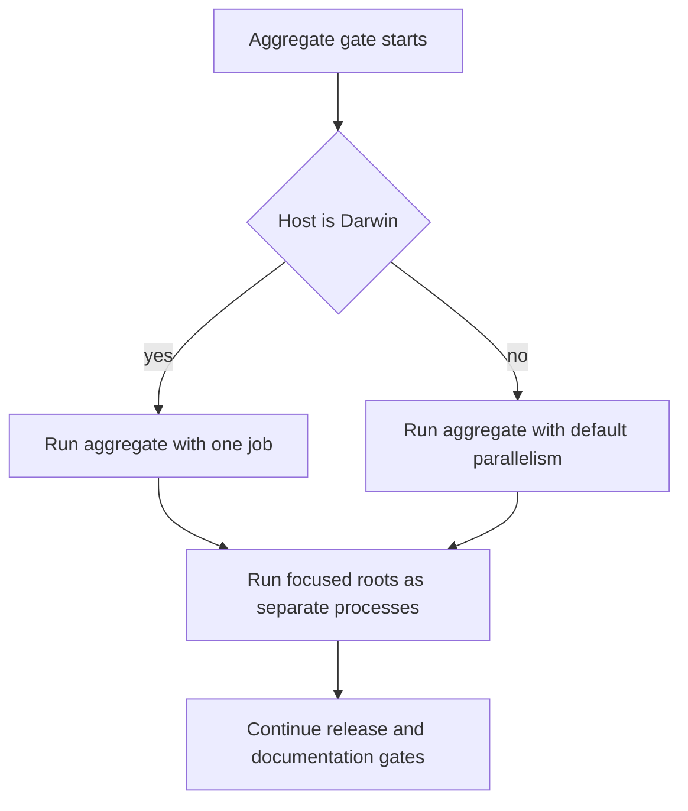
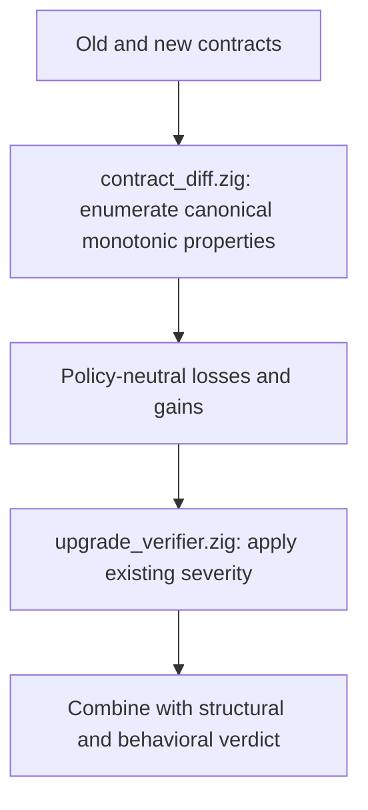
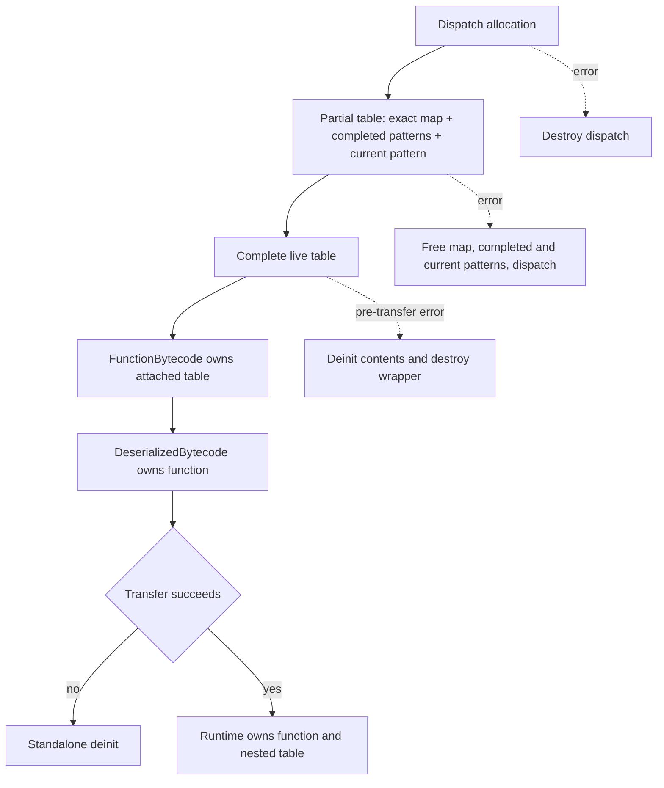

# Audit Correctness Hardening - Plan

## Goal Capsule

- **Objective:** Land the six confirmed audit fixes as seven small delivery units that make verification deterministic on macOS, keep proof and artifact construction fail-closed, close bytecode ownership leaks, and make Pi model selection provider-aware.
- **Product authority:** `STRATEGY.md` makes compiler proof soundness and the expert agent the active product tracks; proof-producing failures must not strengthen a result, and model controls must remain trustworthy across every existing expert surface.
- **Execution profile:** Start with the verification gate, red-prove each behavioral defect in its owning unit, preserve existing behavior outside the confirmed failure paths, and finish with the deterministic full gate.
- **Open blockers:** None. The user selected provider-aware OpenAI model switching and confirmed that macOS work is a gate mitigation rather than a teardown root-cause investigation.
- **Stop conditions:** Stop and re-scope if a unit requires a cache-format migration, provider switching, dynamic model discovery, a public contract change beyond provider-filtered model selection, or a broad compiler/runtime refactor.
- **Tail ownership:** The implementation session owns focused regressions, full repository verification, documentation alignment, cleanup of abandoned attempts, and the repository-required `ce-compound` closeout after the non-trivial fixes are solved and verified.

---

## Product Contract

### Summary

Harden the repository at the six confirmed audit boundaries without redesigning adjacent systems.
The result should be deterministic verification, sound upgrade and path proofs under failure, complete artifact and bytecode cleanup, and one provider-aware model-selection contract shared by CLI, REPL, and RPC.

### Problem Frame

The current checkout contains several narrow fail-open paths where allocation or serialization failure can produce a weaker internal result without stopping the operation.
The upgrade verifier also defines severities for security-property loss that the contract diff never emits, so a security regression can be classified as safe.

The bytecode cache has explicit ownership cleanup on the successful runtime path but incomplete cleanup while deserializing pattern dispatch tables or destroying standalone deserialized bytecode.
Separately, Pi exposes OpenAI as a live backend while its model registry contains only Claude models, causing every model-selection surface to validate against the wrong universe.

The full repository gate is intended to be sequential on macOS, yet the aggregate build step still schedules independent roots in parallel and reproduces the teardown trap that the gate comments describe.
Until that first boundary is deterministic, later delivery units cannot rely on the authoritative local or remote signal.

### Actors

- A1. Zigttp maintainer: implements and reviews each isolated fix and needs deterministic focused and full gates.
- A2. Expert CLI user: chooses a model for the configured provider and expects invalid choices to fail before a provider request.
- A3. RPC client: lists and selects models programmatically and expects the same provider constraints and atomic failure behavior as the REPL.
- A4. Artifact consumer: relies on embedded contracts, attestations, and cached bytecode being complete and internally owned.

### Requirements

**Verification integrity**

- R1. The local verification script, normal CI, and release CI must serialize the aggregate test graph only on macOS while preserving default parallelism on other hosts.
- R2. Every behavioral fix must have a focused regression collected by a real test root, and the completed series must pass the deterministic full repository gate.

**Proof and upgrade soundness**

- R3. Contract diffs must report every monotonic boolean property loss and gain from the canonical `HandlerProperties` definition while preserving inverse-property, numeric, cost, and missing-properties semantics.
- R4. Upgrade analysis must apply its existing critical, warning, and informational severity policy to the newly reachable property changes without inventing new classifications.
- R5. Every proof-bearing `PathGenerator` allocation failure must propagate as an error before binding, I/O, behavior, cost, or fault-coverage output is accepted.
- R6. Diagnostics-only and safe optimization fallbacks must remain non-fatal when they cannot strengthen a proof claim; a missing argument signature must disable canonical rewrites.

**Artifact and ownership integrity**

- R7. Once a handler contract exists, contract JSON serialization failure must stop before attestation or artifact assembly and must never embed partial JSON.
- R8. Pattern-dispatch deserialization and standalone deserialized-bytecode cleanup must free exactly the ownership acquired at every failure and success transition.

**Provider-aware model selection**

- R9. Every curated model must carry a provider tag, every real backend default must resolve to one matching registry entry, and model IDs must use exact matching.
- R10. OpenAI's current `gpt-4o-mini` default must be registered with its documented 128,000-token context and 16,384-token output capability while preserving zigttp's existing 8,192-token default request policy.
- R11. Model listing and mutation must be constrained to the active provider, must not switch providers, and must reject unknown or cross-provider models before mutation or network use.
- R12. Rejected model selection must leave the active model and request token budget unchanged across launch, REPL, and RPC flows.
- R13. CLI flags, REPL commands, RPC methods, and session state must derive model validity from one shared registry and active-provider contract.
- R14. Maintained documentation and the changelog must describe shipped OpenAI support, provider-specific model choices, current-session scope, and the fact that model selection does not select a provider.

### Key Flows

- F1. Deterministic verification
  - **Trigger:** A maintainer or CI runner starts the aggregate repository gate.
  - **Actors:** A1.
  - **Steps:** The gate detects the host OS, serializes the aggregate only on macOS, then runs each existing focused and release check in its current order.
  - **Outcome:** A macOS teardown trap no longer makes the authoritative gate nondeterministic, while Linux retains its current throughput.
  - **Covered by:** R1, R2.

- F2. Upgrade property regression
  - **Trigger:** A new contract loses or gains a monotonic proof property relative to the prior contract.
  - **Actors:** A1, A4.
  - **Steps:** The diff enumerates canonical monotonic fields, records the change, and upgrade analysis applies the existing property severity and verdict rules.
  - **Outcome:** Critical loss breaks the upgrade, warning loss requires review, informational loss remains visible without escalation, and gains stay informational.
  - **Covered by:** R3, R4.

- F3. Proof generation under allocation pressure
  - **Trigger:** A proof-bearing PathGenerator allocation fails while collecting bindings, I/O calls, or path/cost state.
  - **Actors:** A1, A4.
  - **Steps:** The error unwinds owned intermediate state and propagates through precompile or contract construction.
  - **Outcome:** No caller accepts a partial behavior or cost contract.
  - **Covered by:** R5, R6.

- F4. Artifact construction under serialization failure
  - **Trigger:** Contract JSON writing or buffer growth fails after compilation produced a contract.
  - **Actors:** A1, A4.
  - **Steps:** Serialization returns an error before attestation and self-extract assembly.
  - **Outcome:** No new artifact is emitted and a pre-existing output file remains untouched.
  - **Covered by:** R7.

- F5. Provider-aware model selection
  - **Trigger:** A user or RPC client lists models or requests a model override.
  - **Actors:** A2, A3.
  - **Steps:** Existing credential precedence selects the backend, the shared registry resolves an exact model for that provider, and the session applies the model and budget atomically.
  - **Outcome:** Matching models succeed; unknown and cross-provider models fail locally without provider switching or partial mutation.
  - **Covered by:** R9, R10, R11, R12, R13, R14.

### Acceptance Examples

- AE1. **Covers R1.** Given the aggregate gate on macOS, when local verification, normal CI, or release CI starts it, then the aggregate runs with one job and the following focused roots remain separate processes.
- AE2. **Covers R3, R4.** Given an old contract with `no_secret_leakage` and a new contract without it, when the normal diff-to-upgrade flow runs, then it records a critical regression and returns a breaking verdict.
- AE3. **Covers R3, R4.** Given a loss of `input_validated`, an informational property loss, and a property gain, when upgrade analysis runs, then only the warning loss raises `needs_review`, all changes remain visible, and the gain stays informational.
- AE4. **Covers R5, R6.** Given forced allocation failure while recording bindings or I/O state, when path generation runs, then it returns `OutOfMemory`, frees intermediate ownership, and emits no partial contract; signature allocation failure instead emits `null` and disables canonical rewrites.
- AE5. **Covers R7.** Given a compiled handler contract and forced JSON writer failure, when artifact construction runs, then it returns the writer error before signing or output creation and preserves any existing output file.
- AE6. **Covers R8.** Given a multi-pattern dispatch where a later pattern or wrapper allocation fails, when deserialization unwinds, then prior and partial patterns are freed once and successful standalone deinitialization also frees the completed dispatch.
- AE7. **Covers R9, R10, R11.** Given an OpenAI-backed session, when models are listed or `gpt-4o-mini` is selected, then only OpenAI models are visible, selection succeeds, and its explicit registry request policy remains 8,192 tokens.
- AE8. **Covers R11, R12, R13.** Given an Anthropic-backed session and a valid OpenAI model ID, when CLI startup, REPL, or RPC attempts the selection, then the attempt fails before a provider request and both model and token budget remain unchanged.
- AE9. **Covers R11, R13.** Given both provider credentials and an OpenAI model override, when session initialization follows current precedence, then Anthropic remains active and the model is rejected as cross-provider rather than switching backends.

### Success Criteria

- All three authoritative macOS aggregate gates use Darwin-only serialization and Linux behavior is unchanged.
- Every monotonic proof property is covered by a drift-resistant contract-diff test and the upgrade verifier's existing severity table is reachable through integration tests.
- Forced PathGenerator and contract-serialization failures terminate without exposing partial proof or artifact output.
- Pattern-dispatch failure and success ownership paths are leak-free under the testing allocator.
- Anthropic and OpenAI sessions expose symmetric provider-filtered model behavior across CLI, REPL, and RPC.
- Maintained model documentation and changelog wording match the implemented provider behavior.
- Focused gates and the deterministic full repository gate pass with no unrelated source, generated output, or compatibility scaffolding in the diff.

### Scope Boundaries

**In scope**

- The six confirmed audit findings and the focused regressions required to prove them.
- Darwin-only aggregate serialization in local, normal CI, and release CI gates.
- Static provider-tagged model metadata and current-session model selection for existing providers.
- Documentation and changelog edits required by the provider behavior correction.

**Outside this plan**

- Root-causing or redesigning Zig/macOS runtime teardown behavior.
- Dynamic provider model discovery, custom model configuration, model lifecycle polling, or a static deprecation flag.
- Selecting or switching providers through a model ID, changing credential precedence, or persisting model overrides across resume.
- Pinning OpenAI to a dated snapshot or migrating the default to a newer model family.
- Cache-format changes, nested-constant cleanup, broader bytecode deserializer refactors, JIT fallback changes, or compiler checker consolidation.
- Backward-compatibility aliases or migration layers for the internal compile-time model registry.

### Dependencies and Assumptions

- Zig 0.16.0 remains the required toolchain and the current build-step names remain authoritative.
- The current Anthropic-first behavior when both provider credentials exist remains intentional.
- `gpt-4o-mini` remains supported by the Responses API and is not currently listed for deprecation; this is a current-source check, not a lifetime guarantee.
- A missing compiled contract retains its current build behavior; only serialization failure after a contract exists becomes fatal.
- Existing null-properties comparison behavior and informational upgrade severities remain unchanged.

### Sources

- `STRATEGY.md` for proof-engine and expert-agent product authority.
- `plans/018-fail-closed-on-analysis-allocation-errors.md` for proof-relevant allocation classification and deterministic failure-injection precedent.
- `plans/007-add-verify-gate.md` and `plans/README.md` for the sequential-gate and deferred pattern-dispatch, serialization, and provider findings.
- `packages/zigts/src/contract_types.zig` for the canonical monotonic-property reflection pattern.
- [OpenAI GPT-4o mini model documentation](https://developers.openai.com/api/docs/models/gpt-4o-mini) for current endpoint, context, output-capability, alias, and snapshot metadata.
- [OpenAI API deprecations](https://developers.openai.com/api/docs/deprecations) for the exact-ID lifecycle check.
- [OpenAI Responses migration guide](https://developers.openai.com/api/docs/guides/migrate-to-responses) for the current API recommendation and confirmation that no endpoint migration belongs in this plan.

---

## Planning Contract

### Product Contract Preservation

This plan bootstraps the Product Contract from the confirmed audit, the user's provider-aware selection decision, and the confirmed scoping synthesis.
No upstream requirements artifact exists and no audit finding was broadened into an adjacent refactor.

### Key Technical Decisions

- KTD1. **Serialize only the Darwin aggregate at every authoritative gate.** Add the OS branch to the local script and both macOS workflow matrices; keep focused roots separate and retain default parallelism elsewhere.
- KTD2. **Derive policy-neutral diff coverage from the canonical property definition.** `contract_diff.zig` reuses `HandlerProperties.isMonotonicProvenSpecName` or the same compile-time field source and owns only canonical change enumeration.
- KTD3. **Keep severity in the upgrade layer.** `upgrade_verifier.zig` alone owns severity and verdict policy; the ZigTS diff layer must not import or reproduce it. Inverse `has_egress`, numeric/cost handling, gains, and absent-properties behavior keep their current semantics.
- KTD4. **Use direct error unions for PathGenerator proof state.** Binding, I/O, and path/cost helpers propagate allocation failures with `try`; `computeArgSignature(...) catch null` remains a conservative optimization fallback because `null` disables canonical rewrites.
- KTD5. **Make serialization an owning boundary.** A small error-returning contract serializer owns its buffer and hands complete bytes to artifact assembly only after writing succeeds.
- KTD6. **Represent nested pattern ownership explicitly.** Partial cleanup releases the dispatch allocation, exact-match map, completed patterns, and current partial pattern. A completed table stays live when ownership nests under `FunctionBytecode` and then `DeserializedBytecode`; only a pre-transfer failure runs `PatternDispatchTable.deinit` and destroys its wrapper.
- KTD7. **Use a provider ADT and atomic session mutation.** The active backend yields one provider or no provider, registry lookup is exact and provider-aware, and model mutation returns an error without changing model or token budget on failure.
- KTD8. **Separate model capability from request policy in registry state.** Each entry represents descriptive output capability and an intentional request budget. Existing Claude selections preserve their current budgets; `gpt-4o-mini` uses 8,192. Initialization and explicit selection validate the complete `{model, request_budget}` state, assert budget does not exceed capability, then commit once.
- KTD9. **Preserve provider and RPC boundaries.** Global exact lookup may validate that a launch ID is known before credentials are loaded, but compatibility is checked after centralized backend selection; existing RPC envelopes remain stable and model IDs never switch providers.
- KTD10. **Keep the registry curated and static.** Register the current alias, not the dated snapshot, and use exact IDs; lifecycle discovery and default-model migration are separate product work.

### High-Level Technical Design

#### Darwin verification branch



#### Upgrade-property data flow



#### Pattern-dispatch ownership lifecycle



#### Provider-aware selection sequence

```mermaid
sequenceDiagram
  participant Surface as CLI REPL or RPC
  participant Session as AgentSession
  participant Registry as Model registry
  participant Provider as Active provider client
  opt CLI before credential resolution
    Surface->>Registry: exact global ID existence check
  end
  Surface->>Session: request exact model id
  Session->>Session: derive active provider or none
  Session->>Registry: resolve exact ID for provider
  alt matching model
    Registry-->>Session: capability and request policy
    Session->>Session: validate complete next state
    Session->>Provider: commit model and request-policy budget
    Session-->>Surface: success
  else no provider, unknown, or cross-provider
    Registry-->>Session: validation error
    Session-->>Surface: error; no mutation or network use
  end
```

### Sequencing

1. Stabilize the Darwin gate so every later unit has a trustworthy completion signal.
2. Land exhaustive upgrade-property diffing before relying on upgrade verdicts for generated contracts.
3. Make PathGenerator fail closed and confirm test-root collection before adding further artifact boundaries.
4. Make contract serialization fatal after a contract exists.
5. Close pattern-dispatch ownership independently of cache-format or nested-constant work.
6. Establish the provider registry and session invariant.
7. Apply that invariant to CLI, REPL, RPC, docs, and the changelog, then run the full deterministic gate.

Units U2 through U5 are independent after U1.
U7 depends on U6; no other unit depends on the provider work.

### System-Wide Impact

- **Proof trust:** All canonical monotonic property changes are surfaced when both contracts contain properties, and proof-bearing allocation failure stops analysis.
- **Artifact trust:** Embedded contract metadata and attestations can no longer be built from a partial JSON buffer.
- **Memory ownership:** Cache validation and standalone deserialization gain complete failure cleanup without changing the bytecode format.
- **Developer workflow:** macOS local and remote gates trade some aggregate speed for deterministic completion; Linux behavior remains unchanged.
- **Expert parity:** Model availability and mutation become consistent across human and programmatic expert surfaces.
- **External behavior:** Known cross-provider model IDs now fail locally instead of reaching the wrong provider; this intentional tightening is limited to the user-approved provider-aware contract.

### Risks and Mitigations

| Risk | Mitigation |
|---|---|
| Reflection accidentally includes inverse or non-boolean properties | Gate enumeration through the canonical monotonic predicate and retain explicit numeric/cost tests. |
| Newly propagated PathGenerator errors leak intermediate buffers | Add `errdefer` coverage before replacing swallowed errors and assert leak-free failure injection. |
| Pattern cleanup double-frees after ownership transfer | Test each ownership transition and use the full table deinitializer only after complete ownership exists. |
| OpenAI registration silently doubles default output requests | Represent capability and request policy separately, check client defaults against registry policy, and assert the 8,192 OpenAI budget. |
| CLI validation and backend selection disagree when both keys exist | Perform provider compatibility after centralized backend selection and test Anthropic-first precedence. |
| Darwin serialization masks a repository-owned runtime defect | Keep the change labeled as a gate mitigation and stop if the failure reproduces in isolated serialized roots. |
| Static external metadata drifts | Keep the registry curated, use exact IDs, and verify lifecycle claims against official provider documentation when models change. |

---

## Implementation Units

### U1. Deterministic Darwin Aggregate Gate

- **Goal:** Make the aggregate test invocation deterministic on macOS across local verification, normal CI, and release CI without slowing other hosts.
- **Requirements:** R1, R2; F1; AE1; KTD1.
- **Dependencies:** None.
- **Files:**
  - `scripts/verify.sh`
  - `.github/workflows/ci.yml`
  - `.github/workflows/release.yml`
- **Approach:** Add one OS-conditioned aggregate invocation to each authoritative surface, preserving all following steps, failure propagation, labels, and ordering.
- **Execution note:** Treat this as configuration and runtime smoke verification; do not add a unit-test abstraction or a new composite build step.
- **Patterns to follow:** Existing `RUNNER_OS` branches in both workflows and the separate-process rule documented in `scripts/verify.sh` and `build.zig`.
- **Test scenarios:**
  1. On macOS, local verification runs the aggregate with one job and continues to the focused runtime root only after success.
  2. On macOS CI, normal and release workflows both select serialized aggregate execution.
  3. On Linux, normal and release workflows keep the existing aggregate invocation and default parallelism.
  4. A failing aggregate still stops the local script and workflow before later gates.
  5. Repeated serialized aggregate runs do not reproduce the confirmed teardown trap.
- **Verification:** The local full gate completes on macOS, workflow syntax remains valid, and review confirms no non-Darwin invocation was serialized.

### U2. Exhaustive Upgrade Property Regression Detection

- **Goal:** Make every existing upgrade-property severity reachable through the normal contract diff and upgrade analysis flow.
- **Requirements:** R3, R4; F2; AE2, AE3; KTD2, KTD3.
- **Dependencies:** U1.
- **Files:**
  - `packages/zigts/src/contract_diff.zig`
  - `packages/tools/src/upgrade_verifier.zig`
- **Approach:** Keep `contract_diff.zig` policy-neutral while exhaustively enumerating canonical monotonic boolean fields when both contracts contain properties; keep severity and final verdict exclusively in `upgrade_verifier.zig`.
- **Execution note:** Start with integration tests that currently demonstrate unreachable critical and warning rules, then add the exhaustive drift guard.
- **Patterns to follow:** `HandlerProperties.provenSpecNames`, `max_proven_specs`, `isMonotonicProvenSpecName`, and the current `propertySeverity` table.
- **Test scenarios:**
  1. Each monotonic boolean toggled from true to false emits one loss with its canonical field name.
  2. Each monotonic boolean toggled from false to true emits one gain and does not become a regression.
  3. `no_secret_leakage` loss flows through `diffContracts` and `analyzeUpgrade` to a critical regression and breaking verdict.
  4. `input_validated` loss flows to a warning regression and `needs_review` verdict.
  5. An informational loss such as `pure` is reported without escalating the underlying verdict.
  6. `has_egress` remains excluded from monotonic loss/gain enumeration.
  7. `max_io_depth` and cost changes remain represented once through their existing paths.
  8. If either contract lacks properties, existing null semantics remain unchanged.
- **Verification:** ZigTS diff tests and rollout/upgrade tests pass, a field added to `HandlerProperties` cannot silently escape the exhaustive test, and the stale “informational only” diff comment is corrected.

### U3. Fail-Closed PathGenerator Allocation Handling

- **Goal:** Propagate proof-bearing allocation failures and clean newly reachable error paths before callers consume generated behavior or cost data.
- **Requirements:** R5, R6; F3; AE4; KTD4.
- **Dependencies:** U1.
- **Files:**
  - `packages/zigts/src/path_generator.zig`
  - `packages/tools/src/precompile.zig`
- **Approach:** Convert binding scans and module-call tracking to error-returning helpers, propagate binding-map and I/O-sequence failures, and install cleanup before exposing those errors. Preserve null argument signatures as a conservative no-rewrite fallback; extract a private path-analysis stage with an explicit allocator so precompile propagation can fail deterministically after earlier stages succeed.
- **Execution note:** Use targeted allocation failure rather than a brittle global allocation ordinal; verify the new tests are collected by the intended roots.
- **Patterns to follow:** `plans/018-fail-closed-on-analysis-allocation-errors.md`, existing `try` propagation in `PathGenerator.generate`, and adjacent `FailingAllocator` coverage in `precompile.zig`.
- **Test scenarios:**
  1. Import-binding insertion failure returns `OutOfMemory` and unwinds generated state.
  2. Handler or local binding insertion failure returns `OutOfMemory`.
  3. I/O sequence append failure returns `OutOfMemory` rather than lowering I/O depth or cost.
  4. Argument-signature allocation failure emits `null`, and canonicalization performs no rewrite involving that call.
  5. Newly reachable fatal failures free owned names, I/O stubs, and constraint snapshots.
  6. Precompile contract construction propagates forced path-analysis failure and emits no partial behavior or cost contract.
  7. Schema-bound and loop-description fallbacks that cannot strengthen proofs retain their existing weak-proof or diagnostic behavior.
- **Verification:** Focused ZigTS and precompile tests prove both propagation and leak-free teardown; a temporary canary confirms the tests are collected.

### U4. Fail-Closed Build Contract Serialization

- **Goal:** Prevent partial contract JSON or missing default-on attestation after a compiled contract fails to serialize.
- **Requirements:** R7; F4; AE5; KTD5.
- **Dependencies:** U1.
- **Files:**
  - `packages/runtime/src/build_command.zig`
- **Approach:** Introduce one owned serializer plus a private artifact-tail orchestration seam with explicit serializer, signer, and creator capabilities. Production uses the existing functions; tests force serialization failure after compilation and prove neither later capability runs.
- **Execution note:** Keep `buildArtifact` and the self-extract payload format unchanged outside the serialization boundary.
- **Patterns to follow:** Error-propagating contract writers in `packages/tools/src/precompile.zig`, `packages/runtime/src/live_reload.zig`, and `packages/runtime/src/proof_cli.zig`.
- **Test scenarios:**
  1. Normal serialization produces complete JSON that the contract parser accepts.
  2. Forced buffer growth or writer failure returns `OutOfMemory` and frees partial bytes.
  3. Serialization failure with attestation enabled stops before signing.
  4. Serialization failure with `--no-attest` still stops because the embedded contract would be incomplete.
  5. Failure before artifact assembly emits no new artifact and leaves a pre-existing output sentinel untouched.
  6. A genuinely absent compiled contract retains its existing behavior.
- **Verification:** Focused CLI/build tests parse normal JSON and prove signing/creation are not reached on failure; `zig build smoke-v1` proves the normal artifact still builds and runs but is not treated as contract/attestation inspection.

### U5. Pattern Dispatch Ownership Cleanup

- **Goal:** Free pattern-dispatch ownership exactly once through partial decode, wrapper failure, standalone deinitialization, and runtime transfer.
- **Requirements:** R8; AE6; KTD6.
- **Dependencies:** U1.
- **Files:**
  - `packages/zigts/src/bytecode_cache.zig`
  - `packages/runtime/src/zruntime.zig`
- **Approach:** Track the current partial pattern and initialized count, clean the exact map and dispatch allocation too, and destroy the complete table wrapper after `PatternDispatchTable.deinit` until ownership nests under the function.
- **Execution note:** Keep wrapper-level fixtures free of constants so unrelated nested-constant ownership remains outside this unit.
- **Patterns to follow:** `HandlerPattern.deinit` for partial cleanup and `PatternDispatchTable.deinit` for complete contents in `bytecode.zig`, runtime destruction in `object.zig`, and `checkAllAllocationFailures` in `packages/runtime/src/contract_runtime.zig`.
- **Test scenarios:**
  1. An invalid pattern tag after wrapper allocation returns the existing decode error without leaking.
  2. Truncation during URL, body, prefix, and suffix construction frees the partial current pattern.
  3. A completed first pattern followed by malformed second-pattern input frees both prior and partial ownership.
  4. Exact-match map allocation failure frees the completed patterns and wrapper.
  5. Function allocation failure after dispatch completion frees the complete table.
  6. Shape failure after function ownership frees the function and attached dispatch.
  7. Successful `DeserializedBytecode.deinit` frees an attached dispatch table.
  8. Successful runtime ownership transfer continues to free the dispatch only through runtime object teardown.
- **Verification:** `zig build test-zigts test-zruntime` passes under leak detection across decode, standalone cleanup, and runtime transfer with no cache-format change.

### U6. Provider Registry and Session Invariant

- **Goal:** Establish one tagged, exact, provider-aware registry and an atomic session mutation boundary for Anthropic and OpenAI.
- **Requirements:** R9, R10, R11, R12; F5; AE7, AE8, AE9; KTD7, KTD8, KTD10.
- **Dependencies:** U1.
- **Files:**
  - `packages/pi/src/providers/models.zig`
  - `packages/pi/src/agent.zig`
- **Approach:** Add a provider ADT plus distinct capability and request-policy metadata, register every real backend default, expose the active provider or none from the backend tagged union, compute a complete valid next state, and commit model and budget once.
- **Execution note:** Preserve the current static registry and Anthropic-first credential precedence; do not add snapshot aliases or dynamic discovery.
- **Patterns to follow:** Existing provider backend tagged union in `agent.zig`, compile-time model registry, Anthropic/OpenAI default constants, and exhaustive switches over provider/backend state.
- **Test scenarios:**
  1. Registry IDs are exact and globally unique, and each provider default appears once under the matching provider.
  2. Provider-filtered enumeration never returns a model from the other provider.
  3. `gpt-4o-mini` resolves to OpenAI with a 128,000 context window and 16,384 output capability.
  4. OpenAI initialization and explicit `gpt-4o-mini` selection both use the registry's 8,192 request policy.
  5. Existing Claude selections retain their current budgets; every request budget is at most the model capability.
  6. Unknown and cross-provider IDs return distinct local errors while leaving model and budget unchanged.
  7. A stub backend reports no active provider and cannot silently accept a model.
  8. The OpenAI context-window path uses registry metadata rather than the unregistered-default special case.
  9. A similarly prefixed but unregistered specialized OpenAI model does not resolve.
- **Verification:** Expert application tests prove registry invariants, backend defaults, atomic failure, and behavior-preserving request budgets without a live provider call.

### U7. CLI, REPL, RPC, and Documentation Parity

- **Goal:** Apply the provider/session invariant consistently to every existing model surface and align maintained documentation.
- **Requirements:** R11, R12, R13, R14; F5; AE7, AE8, AE9; KTD7, KTD9, KTD10.
- **Dependencies:** U6.
- **Files:**
  - `packages/pi/src/app.zig`
  - `packages/pi/src/repl.zig`
  - `packages/pi/src/rpc_mode.zig`
  - `docs/cli.md`
  - `docs/user-guide.md`
  - `packages/pi/README.md`
  - `CHANGELOG.md`
- **Approach:** Retain exact global ID parsing where credentials are unavailable, validate provider compatibility after centralized session construction, filter listings by session provider, and route mutation through the fallible atomic session operation before persistence or mode execution. Add an Unreleased changelog entry without rewriting the historical 0.18.0 deferral statement.
- **Execution note:** Preserve existing RPC response envelopes and current-session switching semantics; this unit corrects provider filtering and validation rather than adding provider-selection APIs.
- **Patterns to follow:** Shared registry use in current CLI/REPL/RPC code, centralized provider selection in `agent.initFromEnvWithSessionConfig`, and existing docs-drift/link gates.
- **Test scenarios:**
  1. CLI parsing accepts known IDs for both providers and still rejects an unknown ID before session construction.
  2. Anthropic-only credentials accept a Claude override and reject an OpenAI override before REPL, print, JSON, RPC, or autoloop execution.
  3. OpenAI-only credentials accept `gpt-4o-mini` and reject a Claude override before mode execution.
  4. Both credentials preserve Anthropic precedence and reject an OpenAI override rather than switching provider.
  5. Rejected startup overrides create no session directory or event and release duplicated key, prompt, and tool buffers under the leak-detecting allocator.
  6. `/model` lists only active-provider entries and marks the current model; matching selection succeeds and invalid selection changes neither field.
  7. RPC `model.list` filters under explicit Anthropic and OpenAI sessions.
  8. RPC `model.set` preserves its envelope, accepts matching IDs, and returns existing invalid-params for other IDs without mutation.
  9. CLI, REPL, and RPC resolve the same allowed set and current model for equivalent sessions.
  10. Validation errors contain stable local model data only, never keys, provider bodies, or request payloads.
  11. Documentation states provider-specific defaults, current-session switching and request-budget effects, OpenAI's shipped but experimental status, and no provider switching through model IDs.
  12. The stale deferred-OpenAI section is removed without rewriting unrelated Pi architecture documentation.
- **Verification:** Expert application and CLI tests pass; docs-drift and link gates prove their current general checks, while explicit content review confirms provider wording in `docs/cli.md`, `docs/user-guide.md`, `packages/pi/README.md`, and the changelog.

---

## Verification Contract

| Scope | Command | Completion signal |
|---|---|---|
| Formatting | `zig fmt --check build.zig packages/` | All touched Zig files and the build graph are format-clean. |
| Darwin gate | `zig build test -j1` | The aggregate completes repeatedly on macOS without the teardown trap. |
| Upgrade and diff | `zig build test-zigts test-rollout` | Exhaustive property diff and integrated upgrade verdict scenarios pass. |
| Path generation | `zig build test-zigts test-precompile` | Allocation failures propagate and no partial contract is emitted. |
| Artifact build | `zig build test-cli && zig build smoke-v1` | Serializer failure ordering and normal artifact creation both pass. |
| Bytecode ownership | `zig build test-zigts test-zruntime` | Decode, standalone, and runtime-transfer ownership transitions are leak-free. |
| Provider core and parity | `zig build test-expert-app test-cli` | Registry/session invariants and CLI/REPL/RPC parity pass. |
| Documentation | `zig build test-docs-drift test-doc-links` | Maintained docs match the provider registry and all links resolve. |
| Examples and release surface | `bash scripts/test-examples.sh && zig build -Doptimize=ReleaseFast` | Examples and release binaries remain compatible. |
| Full repository gate | `bash scripts/verify.sh` | Every CI-like test, smoke, policy, semantics, expert, and format step passes in order. |
| Diff hygiene | `git diff --check && git status --short` | No whitespace errors, generated artifacts, secrets, or unrelated edits are present. |

Behavior-changing tests should be red-proven against the pre-fix path before the implementation is accepted.
Allocation tests must demonstrate both the expected error and leak-free cleanup, and new inline test blocks must be confirmed reachable from a real build test root.

---

## Definition of Done

- U1 through U7 satisfy their listed requirements, test scenarios, and verification outcomes in dependency order.
- The local, normal CI, and release CI aggregate gates use the same Darwin-only serialization rule.
- Upgrade analysis cannot classify a critical or warning monotonic property loss as safe because the diff omitted it.
- Path generation and contract serialization cannot expose partial proof or artifact data after allocation or writer failure.
- Pattern-dispatch ownership is leak-free and single-owner across partial decode, completed decode, wrapper failure, standalone deinit, and runtime transfer.
- Anthropic and OpenAI model selection is provider-filtered, exact, atomic on failure, and behaviorally consistent across CLI, REPL, and RPC.
- OpenAI's documented capability metadata and zigttp's request policy remain distinct, and the default request budget does not change accidentally.
- Maintained docs and a new Unreleased changelog entry match shipped provider behavior; historical release notes remain intact and the forward-looking Pi deferral is removed.
- Focused tests, documentation gates, release build, examples, and the deterministic full repository gate pass on the pinned toolchain.
- Abandoned approaches, temporary canaries, debug output, generated artifacts, compatibility scaffolding, and unrelated cleanup are absent from the final diff.
- The work session runs `ce-compound` after the solved, verified, non-trivial fixes to capture durable proof, ownership, or provider-contract learnings.
